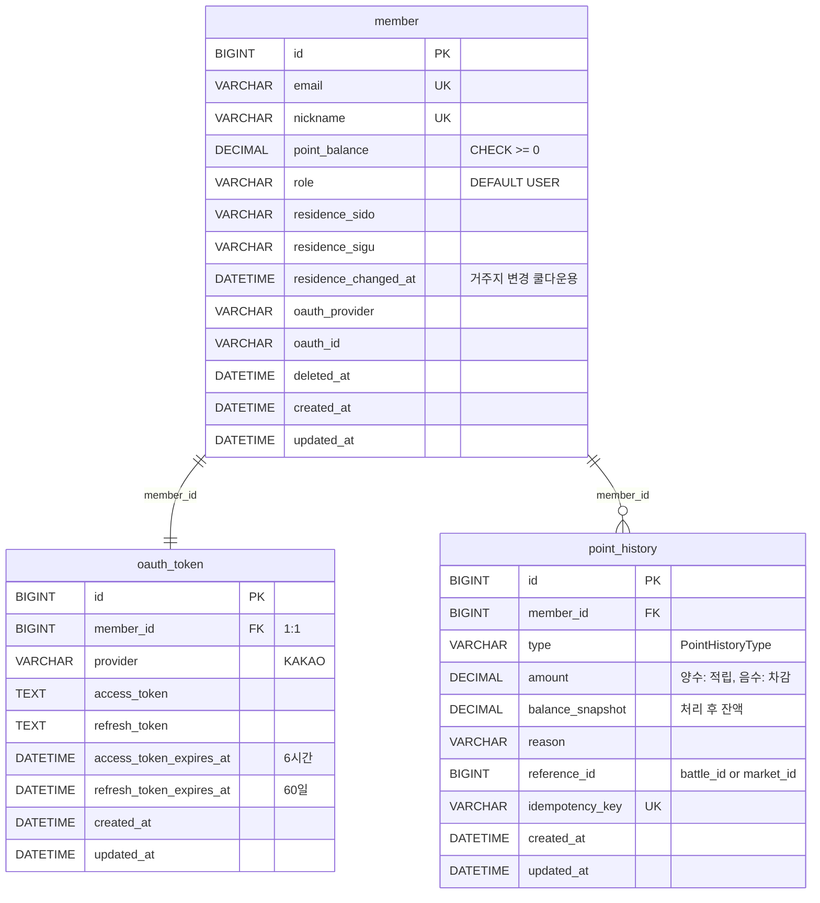

# ERD.md

> 동네대전 전체 서비스의 핵심 테이블 관계 개요이다.  
> 각 서비스의 상세 ERD는 `docs/{service}/ERD.md`를 참조한다.

---

## 1. 서비스별 DB 분리 원칙

각 마이크로서비스는 독립된 DB를 가진다.  
서비스 간 직접 JOIN은 허용하지 않으며, 데이터 연계는 REST API 호출을 통해 처리한다.

| 서비스 | DB 스키마 | 핵심 테이블 |
|---|---|---|
| Member-Point Service | `memberpoint` | `member`, `oauth_token`, `point_history` |
| Battle Service | `battle` | `battle`, `battle_vote`, `comment` |
| Market Service | `market` | `market`, `market_prediction` |
| Insight-Reputation Service | `insight` | `reputation`, `visit_certification`, `insight_report` |

---

## 2. 전체 테이블 목록

### 2-1. Member-Point Service

| 테이블 | 설명 |
|---|---|
| `member` | 회원 정보, 포인트 잔액 |
| `oauth_token` | 카카오 OAuth 토큰 (access/refresh) |
| `point_history` | 포인트 적립/차감/정산 이력 |

### 2-2. Battle Service

| 테이블 | 설명 |
|---|---|
| `battle` | Battle 주제, 상태, 투표 기간 |
| `battle_vote` | 개별 투표 기록 |
| `comment` | Battle 댓글 |
| `point_reward_retry_queue` | Point 지급 재시도 큐 |

### 2-3. Market Service

| 테이블 | 설명 |
|---|---|
| `market` | Market 주제, 판정 규칙, 상태 |
| `market_prediction` | 개별 예측 참여 기록 |

### 2-4. Insight-Reputation Service

| 테이블 | 설명 |
|---|---|
| `reputation` | 사용자 신뢰도 점수 |
| `visit_certification` | 방문 인증 기록 |
| `insight_report` | AI 분석 리포트 결과 |

---

## 3. 핵심 테이블 스키마

### 3-1. member

```sql
CREATE TABLE member (
    id                   BIGINT          NOT NULL AUTO_INCREMENT,
    email                VARCHAR(255)    UNIQUE,                     -- 카카오 이메일 (선택 제공)
    nickname             VARCHAR(50)     NOT NULL UNIQUE,
    point_balance        DECIMAL(10,2)   NOT NULL DEFAULT 0.00 CHECK (point_balance >= 0),
    role                 VARCHAR(20)     NOT NULL DEFAULT 'USER',    -- USER, ADMIN
    residence_sido       VARCHAR(50),
    residence_sigu       VARCHAR(50),
    residence_changed_at DATETIME,                                   -- 거주지 변경 쿨다운 30일 계산용
    oauth_provider       VARCHAR(20)     NOT NULL,                   -- KAKAO
    oauth_id             VARCHAR(255)    NOT NULL,                   -- 카카오 고유 사용자 ID
    deleted_at           DATETIME,
    created_at           DATETIME        NOT NULL,
    updated_at           DATETIME        NOT NULL,
    PRIMARY KEY (id),
    UNIQUE KEY uq_oauth (oauth_provider, oauth_id)                  -- OAuth 중복 가입 방지
);
```

### 3-2. oauth_token

```sql
CREATE TABLE oauth_token (
    id                       BIGINT      NOT NULL AUTO_INCREMENT,
    member_id                BIGINT      NOT NULL UNIQUE,            -- member.id FK (1:1)
    provider                 VARCHAR(20) NOT NULL,                   -- KAKAO
    access_token             TEXT        NOT NULL,                   -- 카카오 access token
    refresh_token            TEXT        NOT NULL,                   -- 카카오 refresh token
    access_token_expires_at  DATETIME    NOT NULL,                   -- access token 만료일 (6시간)
    refresh_token_expires_at DATETIME    NOT NULL,                   -- refresh token 만료일 (60일)
    created_at               DATETIME    NOT NULL,
    updated_at               DATETIME    NOT NULL,
    PRIMARY KEY (id),
    FOREIGN KEY (member_id) REFERENCES member(id)
);
```

### 3-3. point_history

```sql
CREATE TABLE point_history (
    id                  BIGINT          NOT NULL AUTO_INCREMENT,
    member_id           BIGINT          NOT NULL,                    -- member.id 참조 (REST)
    type                VARCHAR(50)     NOT NULL,                    -- PointHistoryType
    amount              DECIMAL(10,2)   NOT NULL,                    -- 양수: 적립, 음수: 차감
    balance_snapshot    DECIMAL(10,2)   NOT NULL,                    -- 처리 후 잔액
    reason              VARCHAR(255),                                -- 사용자 노출용 설명
    reference_id        BIGINT,                                      -- 연관 battle_id / market_id
    idempotency_key     VARCHAR(100)    UNIQUE,                      -- 중복 처리 방지
    created_at          DATETIME        NOT NULL,
    updated_at          DATETIME        NOT NULL,
    PRIMARY KEY (id)
);

-- 인덱스
CREATE INDEX idx_point_history_member_id ON point_history(member_id);
CREATE INDEX idx_point_history_created_at ON point_history(created_at);
CREATE INDEX idx_point_history_type ON point_history(type);
```

### 3-4. battle

```sql
CREATE TABLE battle (
    id              BIGINT          NOT NULL AUTO_INCREMENT,
    title           VARCHAR(255)    NOT NULL,
    option_a        VARCHAR(100)    NOT NULL,
    option_b        VARCHAR(100)    NOT NULL,
    status          VARCHAR(20)     NOT NULL DEFAULT 'PENDING',  -- BattleStatus
    created_by      BIGINT          NOT NULL,           -- member.id 참조 (REST)
    start_at        DATETIME        NOT NULL,
    end_at          DATETIME        NOT NULL,
    vote_count      INT             NOT NULL DEFAULT 0,
    deleted_at      DATETIME,
    created_at      DATETIME        NOT NULL,
    updated_at      DATETIME        NOT NULL,
    PRIMARY KEY (id)
);
```

### 3-5. battle_vote

```sql
CREATE TABLE battle_vote (
    id              BIGINT          NOT NULL AUTO_INCREMENT,
    battle_id       BIGINT          NOT NULL,
    member_id       BIGINT          NOT NULL,           -- member.id 참조 (REST)
    selected_option VARCHAR(10)     NOT NULL,           -- 'A' or 'B'
    created_at      DATETIME        NOT NULL,
    updated_at      DATETIME        NOT NULL,
    PRIMARY KEY (id),
    UNIQUE KEY uq_battle_vote (battle_id, member_id)   -- 중복 투표 방지
);
```

### 3-6. comment

```sql
CREATE TABLE comment (
    id          BIGINT          NOT NULL AUTO_INCREMENT,
    battle_id   BIGINT          NOT NULL,
    member_id   BIGINT          NOT NULL,               -- member.id 참조 (REST)
    content     TEXT            NOT NULL,
    deleted_at  DATETIME,
    created_at  DATETIME        NOT NULL,
    updated_at  DATETIME        NOT NULL,
    PRIMARY KEY (id)
);
```

### 3-7. point_reward_retry_queue

```sql
CREATE TABLE point_reward_retry_queue (
    id              BIGINT          NOT NULL AUTO_INCREMENT,
    member_id       BIGINT          NOT NULL,
    reference_id    BIGINT          NOT NULL,           -- battle_id
    type            VARCHAR(50)     NOT NULL,           -- PointHistoryType
    amount          DECIMAL(10,2)   NOT NULL,
    idempotency_key VARCHAR(100)    NOT NULL UNIQUE,
    retry_count     INT             NOT NULL DEFAULT 0,
    status          VARCHAR(20)     NOT NULL DEFAULT 'PENDING',  -- PENDING, SUCCESS, FAILED
    created_at      DATETIME        NOT NULL,
    updated_at      DATETIME        NOT NULL,
    PRIMARY KEY (id)
);
```

### 3-8. market

```sql
CREATE TABLE market (
    id                  BIGINT          NOT NULL AUTO_INCREMENT,
    title               VARCHAR(255)    NOT NULL,
    description         TEXT,
    judge_data_source   VARCHAR(255)    NOT NULL,       -- 판정 데이터 출처
    judge_criteria      TEXT            NOT NULL,       -- 판정 기준 설명
    judge_date          DATE            NOT NULL,       -- 판정 기준일
    status              VARCHAR(20)     NOT NULL DEFAULT 'PENDING',  -- MarketStatus
    close_at            DATETIME        NOT NULL,       -- 예측 마감일
    settle_at           DATETIME,                       -- 실제 정산일
    result_option       VARCHAR(100),                   -- 확정된 결과 선택지
    total_pool          DECIMAL(10,2)   NOT NULL DEFAULT 0,
    created_by          BIGINT          NOT NULL,       -- member.id 참조 (REST)
    deleted_at          DATETIME,
    created_at          DATETIME        NOT NULL,
    updated_at          DATETIME        NOT NULL,
    PRIMARY KEY (id)
);
```

### 3-9. market_prediction

```sql
CREATE TABLE market_prediction (
    id                  BIGINT          NOT NULL AUTO_INCREMENT,
    market_id           BIGINT          NOT NULL,
    member_id           BIGINT          NOT NULL,       -- member.id 참조 (REST)
    selected_option     VARCHAR(100)    NOT NULL,
    point_amount        DECIMAL(10,2)   NOT NULL,
    status              VARCHAR(20)     NOT NULL DEFAULT 'PENDING',  -- PredictionStatus
    settled_amount      DECIMAL(10,2),                  -- 정산 후 지급액
    idempotency_key     VARCHAR(100)    NOT NULL UNIQUE,
    created_at          DATETIME        NOT NULL,
    updated_at          DATETIME        NOT NULL,
    PRIMARY KEY (id),
    UNIQUE KEY uq_market_prediction (market_id, member_id)  -- 중복 참여 방지
);
```

### 3-10. reputation

```sql
CREATE TABLE reputation (
    id                      BIGINT          NOT NULL AUTO_INCREMENT,
    member_id               BIGINT          NOT NULL UNIQUE,    -- member.id 참조 (REST)
    activity_score          INT             NOT NULL DEFAULT 0,
    prediction_count        INT             NOT NULL DEFAULT 0,
    prediction_correct      INT             NOT NULL DEFAULT 0,
    prediction_accuracy     DECIMAL(5,2)    NOT NULL DEFAULT 0, -- 예측 정확도 (%)
    residence_sido          VARCHAR(50),
    residence_sigu          VARCHAR(50),
    residence_declared_at   DATETIME,
    created_at              DATETIME        NOT NULL,
    updated_at              DATETIME        NOT NULL,
    PRIMARY KEY (id)
);
```

### 3-11. visit_certification

```sql
CREATE TABLE visit_certification (
    id              BIGINT          NOT NULL AUTO_INCREMENT,
    member_id       BIGINT          NOT NULL,           -- member.id 참조 (REST)
    sido            VARCHAR(50)     NOT NULL,
    sigu            VARCHAR(50)     NOT NULL,
    method          VARCHAR(20)     NOT NULL,           -- GPS, COMMENT
    certified_at    DATETIME        NOT NULL,
    created_at      DATETIME        NOT NULL,
    updated_at      DATETIME        NOT NULL,
    PRIMARY KEY (id)
);
```

### 3-12. insight_report

```sql
CREATE TABLE insight_report (
    id              BIGINT          NOT NULL AUTO_INCREMENT,
    type            VARCHAR(20)     NOT NULL,           -- BATTLE, MARKET
    reference_id    BIGINT          NOT NULL,           -- battle_id 또는 market_id
    summary         TEXT            NOT NULL,           -- AI 요약 결과
    raw_prompt      TEXT,                               -- 사용한 프롬프트 (디버깅용)
    created_at      DATETIME        NOT NULL,
    updated_at      DATETIME        NOT NULL,
    PRIMARY KEY (id)
);
```

---

## 4. 서비스 간 참조 관계 (REST 기반)

서비스 간 FK는 존재하지 않는다. 아래는 논리적 참조 관계이다.

```
member.id
  ├── oauth_token.member_id      (Member-Point Service 내부, 1:1)
  ├── point_history.member_id    (Member-Point Service 내부)
  ├── battle.created_by          (Battle Service → Member-Point Service REST 조회)
  ├── battle_vote.member_id      (Battle Service → Member-Point Service REST 조회)
  ├── comment.member_id          (Battle Service → Member-Point Service REST 조회)
  ├── market.created_by          (Market Service → Member-Point Service REST 조회)
  ├── market_prediction.member_id (Market Service → Member-Point Service REST 조회)
  ├── reputation.member_id       (Insight-Reputation Service → Member-Point Service REST 조회)
  └── visit_certification.member_id (Insight-Reputation Service → Member-Point Service REST 조회)

battle.id
  ├── battle_vote.battle_id      (Battle Service 내부)
  ├── comment.battle_id          (Battle Service 내부)
  ├── point_reward_retry_queue.reference_id (Battle Service 내부)
  └── insight_report.reference_id (Insight-Reputation Service → Battle Service REST 조회)

market.id
  ├── market_prediction.market_id (Market Service 내부)
  └── insight_report.reference_id (Insight-Reputation Service → Market Service REST 조회)
```

---

## 5. ERD 다이어그램 (Member-Point Service)



---

## 6. PK 전략

- 전체 서비스 통일: `BIGINT AUTO_INCREMENT`
- UUID 미사용 (MVP 범위)
- 멱등성이 필요한 경우: `idempotency_key VARCHAR(100) UNIQUE` 별도 컬럼 사용

---

## 7. 변경 이력

| 버전 | 변경 내용 |
|---|---|
| v1 | `oauth_token` 테이블 추가 (카카오 access/refresh token 정석 관리) |
| v1 | `member` 테이블에 `oauth_provider`, `oauth_id`, `residence_changed_at` 추가 |
| v1 | `point_history` 인덱스 추가 (member_id, created_at, type) |

---

## 8. 상세 ERD 문서 위치

| 서비스 | 상세 ERD |
|---|---|
| Member-Point | `docs/member-point/ERD.md` |
| Battle | `docs/battle/ERD.md` |
| Market | `docs/market/ERD.md` |
| Insight-Reputation | `docs/insight-reputation/ERD.md` |
