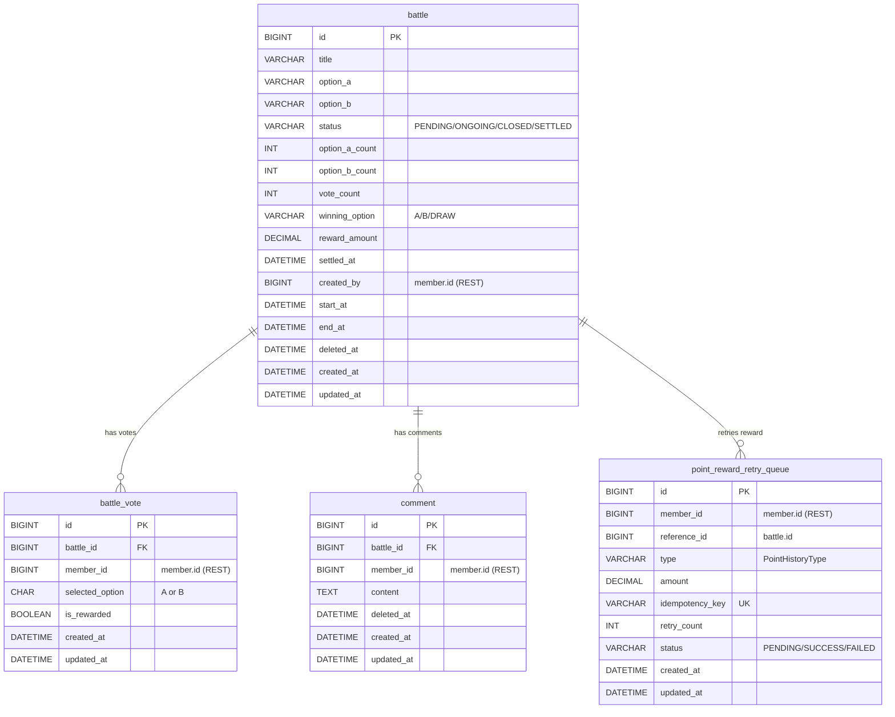
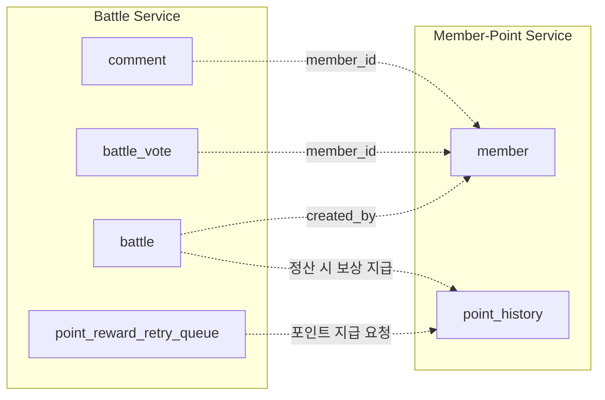
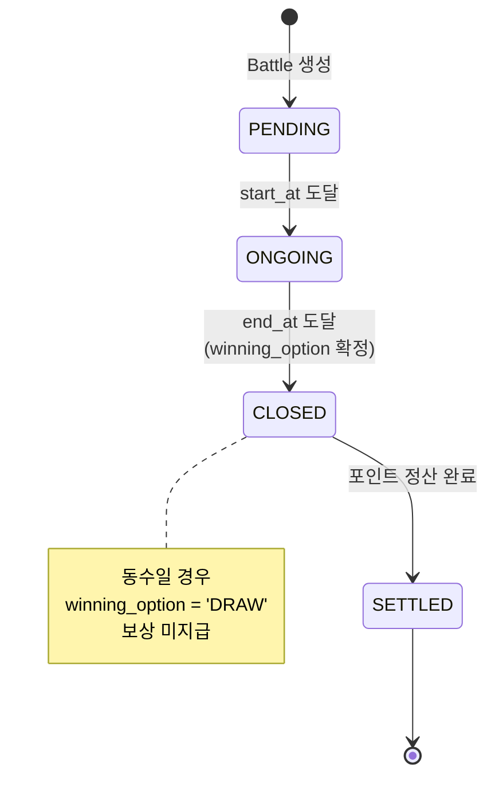
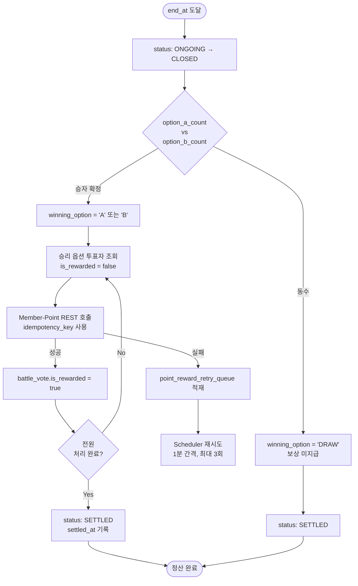

# Battle Service ERD

> 동네대전 Battle Service의 ERD이다.
> 회의 결정사항 반영: **댓글 단일 depth** · 댓글 좋아요 없음 · 다수 선택자 보상 · 신고 기능 제외(MVP) · 투표 변경 불가

---

## 0. 회의 반영 결정사항

| 항목 | 결정 | ERD 반영 |
|---|---|---|
| 댓글 구조 | 단일 depth (대댓글 없음) | `comment`에 `parent_id` 없음 |
| 댓글 좋아요 | 미적용 | 별도 테이블 없음 |
| 보상 정책 | 다수 선택자 보상 | `battle.winning_option`, `battle.reward_amount` |
| 신고 기능 | MVP 제외 | `report` 테이블 없음 |
| 투표 변경 | 불가 (1인 1표 확정) | `uq_battle_vote`로 강제, 집계는 단순 증가만 |

---

## 1. ERD 다이어그램

서비스 내부 테이블 관계도이다. `member.id`는 Member-Point Service의 외부 참조이며 FK 없이 REST로 연계된다.



### 1-1. 외부 서비스 참조 (REST 기반)



> 점선(`-.->`)은 REST 호출 기반 논리적 참조이다. DB FK는 존재하지 않는다.

---

## 2. 테이블 목록

| 테이블 | 설명 | 비고 |
|---|---|---|
| `battle` | Battle 주제, 상태, 투표 기간, 결과/보상 | 결과·보상 컬럼 포함 |
| `battle_vote` | 개별 투표 기록 | 보상 지급 여부 플래그 포함 |
| `comment` | Battle 댓글 (단일 depth) | 대댓글 없음 |
| `point_reward_retry_queue` | Point 지급 재시도 큐 | 정산 실패 재처리용 |

---

## 3. 스키마

### 3-1. battle

```sql
CREATE TABLE battle (
    id              BIGINT          NOT NULL AUTO_INCREMENT,
    title           VARCHAR(255)    NOT NULL,
    option_a        VARCHAR(100)    NOT NULL,
    option_b        VARCHAR(100)    NOT NULL,
    status          VARCHAR(20)     NOT NULL DEFAULT 'PENDING',  -- BattleStatus

    -- 집계 (비정규화: 결과 화면 조회 부하 방지)
    option_a_count  INT             NOT NULL DEFAULT 0,
    option_b_count  INT             NOT NULL DEFAULT 0,
    vote_count      INT             NOT NULL DEFAULT 0,          -- = a_count + b_count

    -- 결과 / 보상 (다수 선택자 보상)
    winning_option  VARCHAR(4),                                  -- 'A', 'B', 'DRAW' (정산 전 NULL)
    reward_amount   DECIMAL(10,2)   NOT NULL DEFAULT 0,          -- 승자 1인당 지급 포인트
    settled_at      DATETIME,                                    -- 정산 완료 시각

    created_by      BIGINT          NOT NULL,                    -- member.id (REST)
    start_at        DATETIME        NOT NULL,
    end_at          DATETIME        NOT NULL,
    deleted_at      DATETIME,
    created_at      DATETIME        NOT NULL,
    updated_at      DATETIME        NOT NULL,
    PRIMARY KEY (id),
    KEY idx_battle_status_end (status, end_at, deleted_at)       -- 마감 대상 배치 조회용
);
```

### 3-2. battle_vote

```sql
CREATE TABLE battle_vote (
    id              BIGINT          NOT NULL AUTO_INCREMENT,
    battle_id       BIGINT          NOT NULL,
    member_id       BIGINT          NOT NULL,                    -- member.id (REST)
    selected_option CHAR(1)         NOT NULL,                    -- 'A' or 'B'
    is_rewarded     BOOLEAN         NOT NULL DEFAULT FALSE,      -- 정산 멱등성/재시도 연동
    created_at      DATETIME        NOT NULL,
    updated_at      DATETIME        NOT NULL,
    PRIMARY KEY (id),
    UNIQUE KEY uq_battle_vote (battle_id, member_id)             -- 중복 투표 방지 + battle_id 조회 인덱스 역할 겸함
);
```

> `uq_battle_vote`의 leftmost prefix(`battle_id`)가 일반 인덱스 역할도 하므로
> `WHERE battle_id = ?` 조회는 이 유니크 키로 처리된다. 별도 `idx_vote_battle`은 불필요.

### 3-3. comment (단일 depth)

```sql
CREATE TABLE comment (
    id          BIGINT          NOT NULL AUTO_INCREMENT,
    battle_id   BIGINT          NOT NULL,
    member_id   BIGINT          NOT NULL,                        -- member.id (REST)
    content     TEXT            NOT NULL,
    deleted_at  DATETIME,                                        -- soft delete
    created_at  DATETIME        NOT NULL,
    updated_at  DATETIME        NOT NULL,
    PRIMARY KEY (id),
    KEY idx_comment_battle (battle_id, deleted_at, created_at)   -- 목록 조회/정렬
);
```

### 3-4. point_reward_retry_queue

```sql
CREATE TABLE point_reward_retry_queue (
    id              BIGINT          NOT NULL AUTO_INCREMENT,
    member_id       BIGINT          NOT NULL,
    reference_id    BIGINT          NOT NULL,                    -- battle_id
    type            VARCHAR(50)     NOT NULL,                    -- PointHistoryType
    amount          DECIMAL(10,2)   NOT NULL,
    idempotency_key VARCHAR(100)    NOT NULL UNIQUE,
    retry_count     INT             NOT NULL DEFAULT 0,
    status          VARCHAR(20)     NOT NULL DEFAULT 'PENDING',  -- PENDING, SUCCESS, FAILED
    created_at      DATETIME        NOT NULL,
    updated_at      DATETIME        NOT NULL,
    PRIMARY KEY (id),
    KEY idx_retry_status (status, retry_count, created_at)       -- 재시도 배치 조회용
);
```

---

## 4. 상태값 (Enum)

### 4-1. BattleStatus

```
PENDING   생성됨 / 투표 시작 전 (start_at 이전)
ONGOING   투표 진행 중 (start_at ~ end_at)
CLOSED    투표 마감 / 결과 집계 완료, 정산 대기
SETTLED   포인트 정산 완료
```

### 4-2. 상태 전이도



---

## 5. 정산 흐름 (다수 선택자 보상)



**핵심 포인트**

1. `idempotency_key = "battle:{battle_id}:member:{member_id}"` 형태로 중복 지급 방지
2. `is_rewarded` 플래그 덕분에 배치 중간 실패 후 재실행되어도 이미 지급된 투표는 건너뜀
3. 무승부(`DRAW`)는 보상 없이 바로 SETTLED 처리

---

## 6. 투표 처리 규칙 (확정: 변경 불가)

- 1인 1표, 한 번 투표하면 변경/취소 불가.
- DB 강제: `uq_battle_vote (battle_id, member_id)` 유니크 제약.
  중복 투표 시도는 DB 레벨에서 막히고, 앱은 이를 "이미 투표함" 에러(`ALREADY_VOTED`)로 변환.
- 집계 갱신은 단일 UPDATE 문의 원자성에 의존한다 (별도 비관적 락 불필요).
  ```sql
  UPDATE battle
     SET option_a_count = option_a_count + 1,
         vote_count = vote_count + 1
   WHERE id = ?
  ```
- 권장 구현: `INSERT battle_vote` 성공 후 같은 트랜잭션에서 위 UPDATE 실행.

---

## 7. 추가 합의 필요 사항 (선택)

- **닉네임 조회 N+1**: 댓글/투표 목록 표시 시 `member_id` → 닉네임을 매번 REST 호출하면
  N+1이 된다. Member-Point Service에 "여러 member 일괄 조회" API를 두거나,
  Battle 측에서 닉네임을 짧게 캐시하는 방안을 합의해둘 것.
- **마이페이지 "내가 만든 Battle"**: 해당 기능이 MVP에 포함되면
  `KEY idx_battle_creator (created_by, deleted_at, created_at)` 인덱스 추가.
