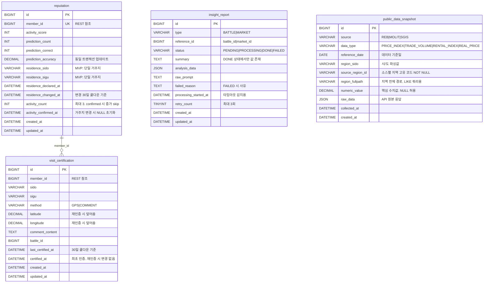

# docs/insight-reputation/ERD_ver4.md

> Insight-Reputation Service의 데이터베이스 설계 문서  
> v4: source_region_id NOT NULL 추가, insight_report processing_started_at/retry_count 추가, public_data_snapshot numeric_value/region_fullpath 컬럼 승격, activity_count 상한 처리 명시, 방문 인증 이력 정책 명시

---

## 변경 내역 (ERD_ver3.md → ERD_ver4.md)

| 테이블 | 변경 내용 |
|---|---|
| `public_data_snapshot` | `source_region_id NOT NULL` 추가. `numeric_value DECIMAL(20,10)`, `region_fullpath VARCHAR(200)` 컬럼 승격 추가 |
| `insight_report` | `processing_started_at DATETIME`, `retry_count TINYINT NOT NULL DEFAULT 0` 추가 |
| `reputation` | `activity_count` 상한 처리 정책 비즈니스 제약에 명시 |
| `visit_certification` | 방문 인증 이력 정책 비즈니스 제약에 명시 |

---

## 1. 테이블 목록 및 역할

| 테이블 | 역할 |
|---|---|
| `reputation` | 회원별 신뢰도 점수 및 거주지역 선언 |
| `visit_certification` | GPS/댓글 기반 방문 인증 기록 |
| `insight_report` | AI 분석 리포트 결과 저장 및 상태 관리 |
| `public_data_snapshot` | 공공 API 배치 수집 데이터 적재 (멀티 소스) |

---

## 2. 테이블 스키마 (DDL)

### 2-1. reputation

```sql
CREATE TABLE reputation (
    id                      BIGINT          NOT NULL AUTO_INCREMENT,
    member_id               BIGINT          NOT NULL UNIQUE,    -- member.id 참조 (REST)
    activity_score          INT             NOT NULL DEFAULT 0,
    prediction_count        INT             NOT NULL DEFAULT 0,
    prediction_correct      INT             NOT NULL DEFAULT 0,
    prediction_accuracy     DECIMAL(5,2)    NOT NULL DEFAULT 0, -- 예측 정확도 (%). prediction_count/prediction_correct와 항상 동일 트랜잭션에서 함께 업데이트
    residence_sido          VARCHAR(50),                        -- 거주지 시/도 (MVP: 단일 거주지)
    residence_sigu          VARCHAR(50),                        -- 거주지 시/구 (MVP: 단일 거주지)
    residence_declared_at   DATETIME,                           -- 거주지 최초 선언 시점
    residence_changed_at    DATETIME,                           -- 거주지 마지막 변경 시점 (30일 쿨다운 기준)
    activity_count          INT             NOT NULL DEFAULT 0, -- 현재 거주지 기준 활동 누적 횟수. 최대 3 (activity_confirmed_at IS NOT NULL이면 증가 skip)
    activity_confirmed_at   DATETIME,                           -- 활동 확인 배지 획득 시점 (거주지 변경 시 NULL로 초기화)
    created_at              DATETIME        NOT NULL,
    updated_at              DATETIME        NOT NULL,
    PRIMARY KEY (id),
    INDEX idx_member_id (member_id)
);
```

### 2-2. visit_certification

```sql
CREATE TABLE visit_certification (
    id                  BIGINT          NOT NULL AUTO_INCREMENT,
    member_id           BIGINT          NOT NULL,           -- member.id 참조 (REST)
    sido                VARCHAR(50)     NOT NULL,
    sigu                VARCHAR(50)     NOT NULL,
    method              VARCHAR(20)     NOT NULL,           -- VisitCertMethod 허용값: 'GPS', 'COMMENT'
    latitude            DECIMAL(10,8),                      -- GPS 인증 시 위도. 재인증 시 덮어씀 (이력 미보존, MVP 이후 로그 테이블 검토)
    longitude           DECIMAL(11,8),                      -- GPS 인증 시 경도. 재인증 시 덮어씀 (이력 미보존, MVP 이후 로그 테이블 검토)
    comment_content     TEXT,                               -- 댓글 기반 인증 시 내용
    battle_id           BIGINT,                             -- 댓글 기반 인증 시 연관 battle_id
    last_certified_at   DATETIME        NOT NULL,           -- 마지막 인증 시점 (30일 쿨다운 기준, Service 레이어에서 체크)
    certified_at        DATETIME        NOT NULL,           -- 최초 인증 시점. INSERT 시 last_certified_at과 동일한 값으로 세팅, 이후 재인증 시 변경하지 않음
    created_at          DATETIME        NOT NULL,
    updated_at          DATETIME        NOT NULL,
    PRIMARY KEY (id),
    UNIQUE KEY uq_member_location (member_id, sido, sigu), -- 지역당 1건 유지 (재인증 시 UPDATE)
    INDEX idx_member_id (member_id)
);
```

> **쿨다운 처리 방식**  
> DB UNIQUE 제약으로 30일을 표현할 수 없으므로 Service 레이어에서 처리한다.  
> `last_certified_at + 30일 > NOW()` 이면 재인증 거부, 가능 날짜를 응답에 포함한다.  
> 재인증 성공 시 기존 레코드를 UPDATE한다 (INSERT 아님).

### 2-3. insight_report

```sql
CREATE TABLE insight_report (
    id                      BIGINT          NOT NULL AUTO_INCREMENT,
    type                    VARCHAR(20)     NOT NULL,               -- InsightReportType 허용값: 'BATTLE', 'MARKET'
    reference_id            BIGINT          NOT NULL,               -- battle_id 또는 market_id
    status                  VARCHAR(20)     NOT NULL DEFAULT 'PENDING', -- 허용값: 'PENDING', 'PROCESSING', 'DONE', 'FAILED'
    summary                 TEXT,                                   -- AI 요약 결과 (DONE 상태에서만 값 존재)
    analysis_data           JSON,                                   -- 분석에 사용된 원본 데이터 (디버깅용)
    raw_prompt              TEXT,                                   -- 사용한 프롬프트 (디버깅용)
    failed_reason           TEXT,                                   -- FAILED 시 사유 (Claude API 타임아웃, 공공데이터 없음 등)
    processing_started_at   DATETIME,                               -- PROCESSING 전이 시 기록. 타임아웃 감지용
    retry_count             TINYINT         NOT NULL DEFAULT 0,     -- 재시도 횟수. 최대 3회 초과 시 FAILED 영구 처리
    created_at              DATETIME        NOT NULL,
    updated_at              DATETIME        NOT NULL,
    PRIMARY KEY (id),
    UNIQUE KEY uq_type_reference (type, reference_id),             -- 중복 리포트 생성 방지
    INDEX idx_type (type),
    INDEX idx_status (status)                                      -- PENDING/FAILED 재처리 조회용
);
```

> **status 전이 흐름**  
> `PENDING` (트리거 시 INSERT) → `PROCESSING` (Claude API 호출 시작, `processing_started_at` 기록)  
> → `DONE` (저장 완료) / `FAILED` (`failed_reason` 기록)

### 2-4. public_data_snapshot

```sql
CREATE TABLE public_data_snapshot (
    id                  BIGINT          NOT NULL AUTO_INCREMENT,
    source              VARCHAR(20)     NOT NULL,           -- 허용값: 'REB', 'MOLIT', 'SGIS'
    data_type           VARCHAR(30)     NOT NULL,           -- 허용값: 'PRICE_INDEX', 'TRADE_VOLUME', 'RENTAL_INDEX', 'REAL_PRICE'
    reference_date      DATE            NOT NULL,           -- 데이터 기준일 (WRTTIME_DESC 파싱)
    region_sido         VARCHAR(50),                        -- 시/도 파싱값. CLS_FULLNM 첫 번째 값 (예: 서울, 경기). 전국 단위면 '전국'
    source_region_id    VARCHAR(50)     NOT NULL,           -- 소스별 지역 고유 코드. REB: cls_id, MOLIT: 법정동코드 앞 5자리. 전국 단위: '50001'
    region_fullpath     VARCHAR(200),                       -- 지역 전체 경로. REB: cls_fullnm (예: 서울>강북지역>도심권>종로구). LIKE 쿼리용 인덱스 적용
    numeric_value       DECIMAL(20,10),                     -- 핵심 수치값. REB: dta_val. NULL 허용 (비수치 데이터 소스 대비)
    raw_data            JSON            NOT NULL,           -- API 원본 응답 전체. 소스별 구조 상이
    collected_at        DATETIME        NOT NULL,           -- 수집 시점
    created_at          DATETIME        NOT NULL,
    PRIMARY KEY (id),
    UNIQUE KEY uq_snapshot (source, data_type, reference_date, source_region_id),
    INDEX idx_source_type_date (source, data_type, reference_date),
    INDEX idx_region_sido (region_sido),
    INDEX idx_region_fullpath (region_fullpath(100))        -- prefix 인덱스. LIKE '서울%' 쿼리 최적화
);
```

> **REB 소스 적재 예시**
> ```
> source           = 'REB'
> data_type        = 'PRICE_INDEX'
> reference_date   = '2025-05-12'
> region_sido      = '서울'               ← cls_fullnm 첫 번째 값 파싱
> source_region_id = '50043'              ← cls_id
> region_fullpath  = '서울>강북지역>도심권>종로구'  ← cls_fullnm 그대로
> numeric_value    = 95.2273702404922     ← dta_val
> raw_data         = { 원본 JSON 전체 }
> ```

> **변동률 계산 쿼리 예시**
> ```sql
> SELECT this_week.source_region_id,
>        this_week.region_fullpath,
>        this_week.numeric_value - last_week.numeric_value AS diff
> FROM   public_data_snapshot this_week
> JOIN   public_data_snapshot last_week
>   ON   this_week.source = last_week.source
>   AND  this_week.data_type = last_week.data_type
>   AND  this_week.source_region_id = last_week.source_region_id
> WHERE  this_week.reference_date = '2025-05-12'
>   AND  last_week.reference_date = '2025-05-05'
>   AND  this_week.source = 'REB'
>   AND  this_week.data_type = 'PRICE_INDEX'
>   AND  this_week.region_fullpath LIKE '서울%';
> ```

---

## 3. Mermaid ERD 다이어그램



---

## 4. Enum 상세

### 4-1. VisitCertMethod

```java
public enum VisitCertMethod {
    GPS,        // GPS 좌표 기반 방문 인증
    COMMENT     // 댓글 기반 방문 인증
}
```

### 4-2. InsightReportType

```java
public enum InsightReportType {
    BATTLE,     // Battle 투표 결과 분석
    MARKET      // Market 예측 데이터 분석
}
```

### 4-3. InsightReportStatus

```java
public enum InsightReportStatus {
    PENDING,        // 트리거 발생, 처리 대기
    PROCESSING,     // Claude API 호출 중
    DONE,           // 분석 완료
    FAILED          // 실패 (failed_reason 참조)
}
```

### 4-4. PublicDataSource

```java
public enum PublicDataSource {
    REB,    // 한국부동산원 R-ONE API
    MOLIT,  // 국토교통부 공공데이터 포털
    SGIS    // 통계지리정보서비스
}
```

### 4-5. PublicDataType

```java
public enum PublicDataType {
    PRICE_INDEX,    // 가격지수 (주간/월간 아파트 매매·전세)
    TRADE_VOLUME,   // 거래량
    RENTAL_INDEX,   // 상가/오피스텔 임대가격지수
    REAL_PRICE      // 실거래가
}
```

---

## 5. Reputation 가중치 규칙

| 인증 상태 | 가중치 | Insight 레이어 |
|---|---:|---|
| 인증 없음 | 1.0 | 전체 사용자 |
| 거주 선언만 | 1.0 | 거주 선언 레이어 |
| 거주 선언 + 활동 확인 | 1.3 | 활동 확인 레이어 |
| 방문 인증 완료 | 1.2 | 방문자 레이어 |
| 거주 선언 + 방문 인증 | 1.3 | 활동 확인 + 방문자 레이어 |

가중치는 Insight 교차분석 필터링에만 적용, Point 획득 배율에는 영향 없음.

---

## 6. AI 데이터 흐름

```
[배치 스케줄러] (주간/월간 주기)
  → R-ONE API 호출 (STATBL_ID별 페이지네이션)
  → public_data_snapshot INSERT (ON DUPLICATE KEY UPDATE)

[AI 분석 트리거] (Battle 종료 / Market 정산)
  → insight_report PENDING INSERT
  → public_data_snapshot 조회 (region_fullpath/region_sido 필터링, numeric_value 활용)
  → Battle/Market 원본 데이터 조회 (REST)
  → insight_report PROCESSING 업데이트 + processing_started_at 기록
  → Claude API 호출 (수집 데이터 + 원본 데이터 프롬프트 조합)
  → insight_report DONE + summary 저장
  → (실패 시) insight_report FAILED + failed_reason 기록, retry_count 증가
  → Client에 리포트 제공
```

MVP에서는 MCP를 직접 구현하지 않으며, Insight-Reputation Service가 필요한 데이터를 직접 조회한 뒤 Claude API를 호출한다.

---

## 7. 비즈니스 제약사항

### 7-1. 데이터 무결성

- `reputation.member_id`: UNIQUE 제약 (회원당 1개 Reputation)
- `visit_certification`: `(member_id, sido, sigu)` UNIQUE (지역당 1건 유지, 재인증 시 UPDATE)
- `insight_report`: `(type, reference_id)` UNIQUE (중복 리포트 방지)
- `public_data_snapshot`: `(source, data_type, reference_date, source_region_id)` UNIQUE (배치 재실행 시 `ON DUPLICATE KEY UPDATE numeric_value = VALUES(numeric_value), region_fullpath = VALUES(region_fullpath), raw_data = VALUES(raw_data), collected_at = VALUES(collected_at)`)

### 7-2. 방문 인증 제약

- 동일 회원 + 동일 지역: `last_certified_at + 30일 > NOW()` 이면 거부 (Service 레이어)
- GPS 인증: localhost 또는 HTTPS 환경에서만 가능
- 댓글 인증: 해당 지역 Battle에 방문 경험 댓글 작성 후 신청
- 인증 반경: 지역 중심 좌표 기준 2~3km
- GPS 좌표(`latitude`, `longitude`)는 현재 인증 상태만 보존하며 재인증 시 덮어씀. 어뷰징 감지를 위한 인증 이력 로그 테이블은 MVP 이후 검토

### 7-3. 거주지역 변경 제약

- `residence_changed_at + 30일 > NOW()` 이면 변경 거부 (Service 레이어)
- 변경 성공 시 `residence_changed_at` 업데이트, `activity_count = 0`, `activity_confirmed_at = NULL` 동시 초기화

### 7-4. 활동 확인 배지

- 거주 선언한 지역의 Battle에서 투표 또는 댓글 활동 3회 누적 시 획득
- `activity_count` 증가 로직: `activity_confirmed_at IS NOT NULL`이면 증가 skip (Service 레이어)
- `activity_count` 3 도달 시 `activity_confirmed_at` 업데이트 (동일 트랜잭션)
- 거주지역 변경 시 `activity_count = 0`, `activity_confirmed_at = NULL` 초기화

### 7-5. prediction_accuracy 업데이트 정책

- `prediction_count`, `prediction_correct`, `prediction_accuracy`는 항상 동일 트랜잭션에서 함께 업데이트한다.
- `prediction_accuracy = FLOOR((prediction_correct / prediction_count) * 100 * 100) / 100` (소수점 둘째 자리 버림)
- `prediction_count = 0`인 경우 `prediction_accuracy = 0`으로 유지한다.

### 7-6. insight_report 상태 관리

- `PENDING → PROCESSING → DONE / FAILED` 단방향 전이. 역방향 전이 불가.
- `PROCESSING` 전이 시 `processing_started_at` 기록.
- 스케줄러: `status = 'PROCESSING' AND processing_started_at < NOW() - INTERVAL 10 MINUTE` 인 레코드를 `PENDING`으로 리셋 (서버 재시작 등으로 인한 고착 방지)
- `FAILED` 상태 레코드 재시도: `retry_count < 3`이면 `PENDING`으로 리셋 후 `retry_count` 증가. `retry_count >= 3`이면 영구 `FAILED` 처리 및 관리자 확인 대상으로 기록.
- `summary`는 `DONE` 상태에서만 값이 존재한다.

### 7-7. public_data_snapshot 배치 정책

- REB 주간 데이터: 매주 목요일 공표 후 배치 실행
- REB 월간 데이터: 매월 15일 공표 후 배치 실행
- 배치 재실행 시 `ON DUPLICATE KEY UPDATE`로 안전 처리 (멱등성 보장)
- 한 번 적재된 데이터는 삭제하지 않는다 (이력 보존)
- REB 소스: `region_fullpath = cls_fullnm`, `numeric_value = dta_val`, `source_region_id = cls_id`로 매핑하여 적재

### 7-8. AI 분석 제약

- Battle 종료 후 자동 트리거
- Market 정산 완료 후 자동 트리거
- 특정 선택지 추천 금지 (정보 요약만 제공)
