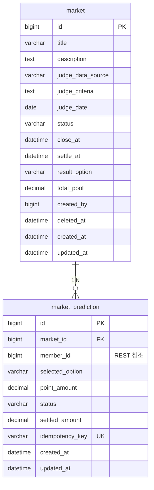

Claude configuration file at /Users/kimmo/.claude.json is corrupted: Unexpected end of JSON input

Claude configuration file at /Users/kimmo/.claude.json is corrupted
The corrupted file has been backed up to: /Users/kimmo/.claude.json.corrupted.1779973278589
A backup file exists at: /Users/kimmo/.claude.json.backup
You can manually restore it by running: cp "/Users/kimmo/.claude.json.backup" "/Users/kimmo/.claude.json"

# Market Service ERD

> Market Service의 데이터베이스 설계 문서이다.  
> 포인트 예측 시장의 핵심 테이블과 비즈니스 로직을 정의한다.

---

## 1. 테이블 목록

| 테이블 | 설명 |
|---|---|
| `market` | Market 주제, 판정 규칙, 상태 관리 |
| `market_prediction` | 개별 예측 참여 기록 |

---

## 2. 테이블 상세 DDL

### 2-1. market

```sql
CREATE TABLE market (
    id                  BIGINT          NOT NULL AUTO_INCREMENT,
    title               VARCHAR(255)    NOT NULL,
    description         TEXT,
    judge_data_source   VARCHAR(255)    NOT NULL,       -- 판정 데이터 출처
    judge_criteria      TEXT            NOT NULL,       -- 판정 기준 설명
    judge_date          DATE            NOT NULL,       -- 판정 기준일
    status              VARCHAR(20)     NOT NULL DEFAULT 'PENDING',  -- MarketStatus
    close_at            DATETIME        NOT NULL,       -- 예측 마감일
    settle_at           DATETIME,                       -- 실제 정산일
    result_option       VARCHAR(100),                   -- 확정된 결과 선택지
    total_pool          DECIMAL(10,2)   NOT NULL DEFAULT 0,  -- 전체 참여 포인트 풀
    created_by          BIGINT          NOT NULL,       -- member.id 참조 (REST)
    deleted_at          DATETIME,
    created_at          DATETIME        NOT NULL,
    updated_at          DATETIME        NOT NULL,
    PRIMARY KEY (id),
    INDEX idx_status (status),
    INDEX idx_close_at (close_at),
    INDEX idx_judge_date (judge_date)
);
```

### 2-2. market_prediction

```sql
CREATE TABLE market_prediction (
    id                  BIGINT          NOT NULL AUTO_INCREMENT,
    market_id           BIGINT          NOT NULL,
    member_id           BIGINT          NOT NULL,       -- member.id 참조 (REST)
    selected_option     VARCHAR(100)    NOT NULL,
    point_amount        DECIMAL(10,2)   NOT NULL,       -- 최소 10, 최대 500
    status              VARCHAR(20)     NOT NULL DEFAULT 'PENDING',  -- PredictionStatus
    settled_amount      DECIMAL(10,2),                  -- 정산 후 지급액
    idempotency_key     VARCHAR(100)    NOT NULL UNIQUE,
    created_at          DATETIME        NOT NULL,
    updated_at          DATETIME        NOT NULL,
    PRIMARY KEY (id),
    UNIQUE KEY uq_market_prediction (market_id, member_id),  -- 중복 참여 방지
    INDEX idx_market_status (market_id, status),
    INDEX idx_member_id (member_id),
    CONSTRAINT chk_point_amount CHECK (point_amount >= 10 AND point_amount <= 500)
);
```

---

## 3. Mermaid ERD



---

## 4. MarketStatus Enum

```java
public enum MarketStatus {
    PENDING,        // 검수 대기
    ACTIVE,         // 예측 참여 가능
    CLOSED,         // 예측 마감 (정산 대기)
    DATA_PENDING,   // 공공 데이터 수신 대기 (최대 7일)
    SETTLED,        // 정산 완료
    VOIDED          // 무효 처리
}
```

### 상태 전환 흐름

```
PENDING → ACTIVE → CLOSED → SETTLED
    ↓        ↓        ↓         ↓
  VOIDED   VOIDED   DATA_PENDING → SETTLED
                       ↓
                     VOIDED (7일 초과 시)
```

---

## 5. PredictionStatus Enum

```java
public enum PredictionStatus {
    PENDING,    // Point 차감 대기
    CONFIRMED,  // 참여 확정 (Point 차감 완료)
    FAILED,     // 참여 실패 (Point 차감 실패)
    SETTLED,    // 정산 완료
    REFUNDED    // 환불 완료 (Market 무효 시)
}
```

### 상태 전환 흐름

```
PENDING → CONFIRMED → SETTLED
   ↓           ↓
 FAILED     REFUNDED (Market VOIDED 시)
```

---

## 6. 정산 공식

### 6-1. 핵심 공식

```
전체 풀 = SUM(point_amount) WHERE status = 'CONFIRMED'
수수료 = 전체 풀 × 5%
정산 대상 풀 = 전체 풀 - 수수료
정산 비율 = 정산 대상 풀 / 승리 선택지 풀
개인 정산액 = 본인 참여 포인트 × 정산 비율 (소수점 셋째 자리 이하 버림)
```

### 6-2. 수수료 소각 정책

- 전체 참여 풀의 **5%**를 시스템 수수료로 소각
- Point 인플레이션 완화 및 희소성 유지 목적
- 운영자 수익이 아닌 시스템에서 완전 제거

### 6-3. 정산 정밀도

- Point 저장: `DECIMAL(10,2)` (소수점 둘째 자리까지)
- 정산 계산: 소수점 셋째 자리 이하 **버림 처리**
- 버림으로 인한 잔여 Point: 시스템 소각

---

## 7. 비즈니스 제약

### 7-1. 참여 제약

- **중복 참여 방지**: `(market_id, member_id)` UNIQUE 제약
- **참여 포인트 범위**: 최소 10P, 최대 500P
- **정산 대상**: `status = 'CONFIRMED'` 상태만 정산 참여
- **멱등성 보장**: `idempotency_key` UNIQUE 제약

### 7-2. Market 상태 제약

- **예측 마감**: `close_at` 이후 새로운 참여 불가
- **정산 대기**: `DATA_PENDING` 상태는 최대 7일 유지
- **7일 초과**: 공공 API 미수신 시 자동 `VOIDED` 전환
- **무효 처리**: `VOIDED` Market의 모든 참여자 전액 환불

### 7-3. 정산 예외

- **승리 선택지 참여자 없음**: 전체 풀 소각 처리
- **무효 처리**: 수수료 소각 없이 전액 환불
- **관리자 정산 오류**: 24시간 내 재정산 가능, 초과 시 수동 보정

---

## 8. 인덱스 전략

### 8-1. 성능 최적화 인덱스

```sql
-- Market 조회 최적화
INDEX idx_status (status)
INDEX idx_close_at (close_at)
INDEX idx_judge_date (judge_date)

-- Prediction 조회 최적화
INDEX idx_market_status (market_id, status)
INDEX idx_member_id (member_id)
```

### 8-2. 정산 쿼리 최적화

```sql
-- 정산 대상 조회
SELECT selected_option, SUM(point_amount) as option_pool
FROM market_prediction 
WHERE market_id = ? AND status = 'CONFIRMED'
GROUP BY selected_option;

-- 개별 정산액 계산
SELECT id, member_id, point_amount, 
       FLOOR(point_amount * ? * 100) / 100 as settled_amount
FROM market_prediction 
WHERE market_id = ? AND selected_option = ? AND status = 'CONFIRMED';
```

---

## 9. 데이터 무결성

### 9-1. 제약 조건

```sql
-- 포인트 범위 검증
CONSTRAINT chk_point_amount CHECK (point_amount >= 10 AND point_amount <= 500)

-- 중복 참여 방지
UNIQUE KEY uq_market_prediction (market_id, member_id)

-- 멱등성 보장
UNIQUE KEY uq_idempotency_key (idempotency_key)
```

### 9-2. 비즈니스 로직 검증

- Market `CLOSED` 상태 확인 후 예측 참여 차단
- Point 잔액 충분성 검증 (Member-Point Service 연계)
- 정산 시 승리 선택지 존재 여부 검증
- 무효 처리 시 환불 대상자 존재 여부 검증
