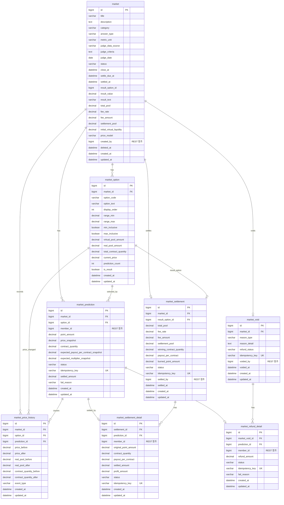

# Market Service ERD

> Market Service의 데이터베이스 설계 문서이다.
> 본 도메인은 REST 기반 MSA 구조에서 독립 DB를 가지며, 포인트 예측 시장의 생성, 선택지 가격 관리, 예측 참여, 가격 변동 기록, 정산, 무효 환불을 담당한다.

---

# 1. 설계 방향

## 1-1. Market 도메인의 역할

Market Service는 사용자가 Point를 사용해 객관적으로 판정 가능한 지역 이벤트를 예측하는 도메인이다.

예시:

```text
다음 주 서울 아파트 매매가격지수는 상승할까?
이번 주 OO구 주택 가격 변동률은 얼마일까?
이번 달 서울 아파트 거래량은 지난달보다 증가할까?
2026년 6월 은마아파트 전용 84㎡ 최고 실거래가는 30억 이상일까?
```

Market은 Battle과 달리 사용자의 투표 결과로 승패가 결정되지 않는다.
결과는 공공데이터, 외부 지표, 관리자 검수 기준에 의해 확정된다.

---

## 1-2. 지원하는 Market 선택지 유형

Market은 YES/NO뿐 아니라 다중 선택지도 지원한다.

```text
YES_NO          : 상승 / 하락, YES / NO
MULTIPLE_CHOICE : 여러 개의 일반 선택지
NUMERIC_RANGE   : 수치 구간 기반 선택지
```

---

## 1-3. YES/NO 예시

```text
질문:
다음 주 서울 아파트 매매가격지수는 상승할까?

선택지:
1. YES
2. NO
```

---

## 1-4. 다중 선택지 예시

```text
질문:
이번 주 OO구 주택 가격 변동률은?

선택지:
1. 0.40% 이상
2. 0.30% 이상 ~ 0.40% 미만
3. 0.20% 이상 ~ 0.30% 미만
4. 0.10% 이상 ~ 0.20% 미만
5. 0.00% 이상 ~ 0.10% 미만
6. 0.00% 미만
```

---

## 1-5. Polymarket-lite 모델

본 프로젝트의 Market은 Polymarket의 핵심 아이디어인 “참여 시점에 따라 계약 가격이 달라지는 구조”를 단순화하여 적용한다.

단, MVP에서는 완전한 오더북, 매도, 지정가 주문, 유동성 공급자 구조는 구현하지 않는다.

MVP의 Market 구조는 다음과 같다.

```text
1. Market에는 여러 선택지가 존재한다.
2. 각 선택지는 현재 가격을 가진다.
3. 사용자가 특정 선택지에 Point를 사용하면, 참여 시점의 가격으로 계약 수량이 계산된다.
4. 다른 사용자의 참여가 누적되면 선택지별 가격이 변동된다.
5. 결과가 확정되면 승리 선택지의 계약 수량 비율에 따라 정산 풀을 분배한다.
```

즉, 사용자의 참여는 단순히 “100P를 걸었다”가 아니라 다음과 같이 저장된다.

```text
100P로 2번 선택지 계약 610.25000000개를 구매했다.
```

---

## 1-6. 기존 단순 풀 배분 방식과의 차이

기존 단순 풀 배분 방식은 다음과 같다.

```text
개인 정산액 = 개인 참여 Point / 승리 선택지 전체 Point × 정산 대상 풀
```

하지만 본 프로젝트의 변동 가격 계약 방식에서는 다음과 같이 정산한다.

```text
개인 정산액 = 개인 보유 승리 계약 수량 / 승리 선택지 전체 계약 수량 × 정산 대상 풀
```

따라서 같은 100P를 사용하더라도 참여 시점의 가격에 따라 계약 수량과 최종 정산액이 달라진다.

---

# 2. 서비스 간 참조 원칙

Market Service는 독립 DB를 가진다.

다른 서비스의 테이블을 직접 FK로 참조하지 않는다.
다른 서비스 데이터가 필요한 경우 REST API를 통해 조회한다.

---

## 2-1. 외부 참조 ID

| 컬럼           | 의미         | 참조 방식                        |
| ------------ | ---------- | ---------------------------- |
| `created_by` | Market 생성자 | Member-Point Service REST 조회 |
| `member_id`  | 예측 참여자     | Member-Point Service REST 조회 |
| `settled_by` | 정산 관리자     | Member-Point Service REST 조회 |
| `voided_by`  | 무효 처리 관리자  | Member-Point Service REST 조회 |

예를 들어 `market_prediction.member_id`는 Member-Point Service의 `member.id`를 의미하지만, Market DB에서 직접 FK를 걸지 않는다.

---

## 2-2. Market 내부 FK

Market Service 내부 테이블끼리는 FK를 사용한다.

```text
market.id
 ├── market_option.market_id
 ├── market_prediction.market_id
 ├── market_price_history.market_id
 ├── market_settlement.market_id
 └── market_void.market_id

market_option.id
 ├── market_prediction.option_id
 ├── market_price_history.option_id
 └── market_settlement.result_option_id

market_prediction.id
 ├── market_price_history.prediction_id
 ├── market_settlement_detail.prediction_id
 └── market_refund_detail.prediction_id
```

---

# 3. 테이블 목록

| 테이블                        | 설명                                  |
| -------------------------- | ----------------------------------- |
| `market`                   | Market 주제, 판정 기준, 상태, 전체 풀 정보       |
| `market_option`            | Market 선택지, 수치 구간, 현재 가격, 선택지별 풀 정보 |
| `market_prediction`        | 사용자별 예측 참여 기록                       |
| `market_price_history`     | 선택지 가격 변동 이력                        |
| `market_settlement`        | Market 단위 정산 결과                     |
| `market_settlement_detail` | 사용자별 정산 지급 상세                       |
| `market_void`              | Market 무효 처리 기록                     |
| `market_refund_detail`     | 무효 처리 시 사용자별 환불 상세                  |

---

# 4. 테이블 상세 DDL

## 4-1. market

Market 주제, 판정 기준, 상태, 정산 정보를 저장한다.

```sql
CREATE TABLE market (
    id                          BIGINT          NOT NULL AUTO_INCREMENT,

    title                       VARCHAR(255)    NOT NULL,
    description                 TEXT,

    category                    VARCHAR(50)     NOT NULL,
    -- PRICE_INDEX, TRANSACTION_VOLUME, ACTUAL_PRICE, POLICY_EVENT

    answer_type                 VARCHAR(30)     NOT NULL,
    -- YES_NO, MULTIPLE_CHOICE, NUMERIC_RANGE

    metric_unit                 VARCHAR(30),
    -- PERCENT, COUNT, KRW, INDEX_POINT 등
    -- NUMERIC_RANGE 타입에서 결과 수치의 단위를 명확히 하기 위해 사용

    judge_data_source           VARCHAR(255)    NOT NULL,
    judge_criteria              TEXT            NOT NULL,
    judge_date                  DATE            NOT NULL,

    status                      VARCHAR(20)     NOT NULL DEFAULT 'PENDING',
    -- PENDING, ACTIVE, CLOSED, DATA_PENDING, SETTLED, VOIDED

    close_at                    DATETIME        NOT NULL,
    settle_due_at               DATETIME,
    settled_at                  DATETIME,

    result_option_id            BIGINT,
    -- 확정된 승리 선택지. market_option.id 논리 참조
    -- 순환 FK 방지를 위해 DDL에서는 FK를 직접 걸지 않는다.

    result_value                DECIMAL(12,4),
    -- NUMERIC_RANGE 타입에서 실제 발표된 수치
    -- 예: 0.3270

    result_text                 VARCHAR(255),
    -- YES/NO 또는 일반 선택지 결과를 보조적으로 기록

    total_pool                  DECIMAL(10,2)   NOT NULL DEFAULT 0.00,
    -- 모든 CONFIRMED 예측 참여 Point 합계

    fee_rate                    DECIMAL(5,2)    NOT NULL DEFAULT 5.00,
    fee_amount                  DECIMAL(10,2)   NOT NULL DEFAULT 0.00,
    settlement_pool             DECIMAL(10,2)   NOT NULL DEFAULT 0.00,

    initial_virtual_liquidity   DECIMAL(10,2)   NOT NULL DEFAULT 100.00,
    -- 선택지별 초기 가상 유동성
    -- 초기 가격이 0으로 시작하지 않도록 방지한다.

    price_model                 VARCHAR(30)     NOT NULL DEFAULT 'POOL_SHARE',
    -- MVP에서는 POOL_SHARE 방식만 사용한다.

    created_by                  BIGINT          NOT NULL,
    -- Member-Point Service의 member.id 외부 참조

    deleted_at                  DATETIME,
    created_at                  DATETIME        NOT NULL,
    updated_at                  DATETIME        NOT NULL,

    PRIMARY KEY (id),

    INDEX idx_market_status (status),
    INDEX idx_market_close_at (close_at),
    INDEX idx_market_judge_date (judge_date),
    INDEX idx_market_status_close_at (status, close_at)
);
```

---

## 4-2. market_option

Market의 선택지와 선택지별 현재 가격 상태를 저장한다.

YES/NO, 일반 다중 선택지, 수치 구간형 선택지를 모두 이 테이블로 표현한다.

```sql
CREATE TABLE market_option (
    id                          BIGINT          NOT NULL AUTO_INCREMENT,

    market_id                   BIGINT          NOT NULL,

    option_code                 VARCHAR(20)     NOT NULL,
    -- YES, NO, A, B, C, 1, 2 등

    option_text                 VARCHAR(100)    NOT NULL,
    -- 사용자에게 표시되는 선택지 문구
    -- 예: "0.30% 이상 ~ 0.40% 미만"

    display_order               INT             NOT NULL DEFAULT 0,

    range_min                   DECIMAL(12,4),
    range_max                   DECIMAL(12,4),
    min_inclusive               BOOLEAN         NOT NULL DEFAULT TRUE,
    max_inclusive               BOOLEAN         NOT NULL DEFAULT FALSE,
    -- NUMERIC_RANGE 타입에서만 사용
    -- 예: 0.30% 이상 ~ 0.40% 미만
    -- range_min = 0.3000, range_max = 0.4000
    -- min_inclusive = TRUE, max_inclusive = FALSE
    -- YES_NO, MULTIPLE_CHOICE 타입에서는 NULL 가능

    virtual_pool_amount         DECIMAL(10,2)   NOT NULL DEFAULT 100.00,
    -- 가격 계산에만 사용하는 가상 유동성

    real_pool_amount            DECIMAL(10,2)   NOT NULL DEFAULT 0.00,
    -- 해당 선택지에 실제로 사용된 Point 총합

    total_contract_quantity     DECIMAL(24,8)   NOT NULL DEFAULT 0.00000000,
    -- 해당 선택지에서 발행된 총 계약 수량

    current_price               DECIMAL(18,8)   NOT NULL DEFAULT 0.00000000,
    -- 현재 1계약당 가격
    -- Market 활성화 시 선택지 개수와 가상 유동성 기준으로 계산한다.
    -- YES/NO면 보통 0.50000000, 5개 선택지면 0.20000000에서 시작한다.

    prediction_count            INT             NOT NULL DEFAULT 0,

    is_result                   BOOLEAN         NOT NULL DEFAULT FALSE,

    created_at                  DATETIME        NOT NULL,
    updated_at                  DATETIME        NOT NULL,

    PRIMARY KEY (id),

    UNIQUE KEY uq_market_option_code (market_id, option_code),
    INDEX idx_market_option_market_id (market_id),
    INDEX idx_market_option_market_order (market_id, display_order),

    CONSTRAINT fk_market_option_market
        FOREIGN KEY (market_id)
        REFERENCES market(id)
);
```

---

## 4-3. market_prediction

사용자의 예측 참여 기록을 저장한다.

핵심은 `point_amount`만 저장하는 것이 아니라 참여 시점의 가격과 계약 수량을 함께 저장하는 것이다.

```sql
CREATE TABLE market_prediction (
    id                                      BIGINT          NOT NULL AUTO_INCREMENT,

    market_id                               BIGINT          NOT NULL,
    option_id                               BIGINT          NOT NULL,

    member_id                               BIGINT          NOT NULL,
    -- Member-Point Service의 member.id 외부 참조

    point_amount                            DECIMAL(10,2)   NOT NULL,
    -- 사용자가 실제로 사용한 Point. 최소 10P, 최대 500P

    price_snapshot                          DECIMAL(18,8)   NOT NULL,
    -- 예측 참여 시점의 1계약당 가격

    contract_quantity                       DECIMAL(24,8)   NOT NULL,
    -- point_amount / price_snapshot

    expected_payout_per_contract_snapshot   DECIMAL(18,8),
    -- 참여 직후 기준 예상 계약 1개당 정산액

    expected_multiplier_snapshot            DECIMAL(18,8),
    -- 참여 직후 기준 예상 배당률

    status                                  VARCHAR(20)     NOT NULL DEFAULT 'PENDING',
    -- PENDING, CONFIRMED, FAILED, SETTLED, REFUNDED

    idempotency_key                         VARCHAR(100)    NOT NULL UNIQUE,
    -- Member-Point Service Point 차감 요청 멱등성 키

    settled_amount                          DECIMAL(10,2),
    -- 정산 후 실제 지급된 Point

    fail_reason                             VARCHAR(255),

    created_at                              DATETIME        NOT NULL,
    updated_at                              DATETIME        NOT NULL,

    PRIMARY KEY (id),

    UNIQUE KEY uq_market_prediction_member (market_id, member_id),
    INDEX idx_market_prediction_market_status (market_id, status),
    INDEX idx_market_prediction_member_id (member_id),
    INDEX idx_market_prediction_option_status (option_id, status),

    CONSTRAINT fk_market_prediction_market
        FOREIGN KEY (market_id)
        REFERENCES market(id),

    CONSTRAINT fk_market_prediction_option
        FOREIGN KEY (option_id)
        REFERENCES market_option(id),

    CONSTRAINT chk_market_prediction_point_amount
        CHECK (point_amount >= 10 AND point_amount <= 500)
);
```

> MVP에서는 동일 사용자가 동일 Market에 한 번만 참여하도록 제한한다.
> 추후 추가 매수/매도 기능을 구현하려면 `market_position`, `market_order`, `market_trade` 테이블을 추가한다.

---

## 4-4. market_price_history

사용자의 예측 참여로 선택지 가격이 변할 때마다 가격 이력을 저장한다.

가격 차트, 디버깅, 참여 시점 검증에 사용한다.

```sql
CREATE TABLE market_price_history (
    id                              BIGINT          NOT NULL AUTO_INCREMENT,

    market_id                       BIGINT          NOT NULL,
    option_id                       BIGINT          NOT NULL,

    prediction_id                   BIGINT,
    -- 어떤 예측 참여로 인해 가격이 변경되었는지 추적

    price_before                    DECIMAL(18,8)   NOT NULL,
    price_after                     DECIMAL(18,8)   NOT NULL,

    real_pool_before                DECIMAL(10,2)   NOT NULL,
    real_pool_after                 DECIMAL(10,2)   NOT NULL,

    contract_quantity_before        DECIMAL(24,8)   NOT NULL,
    contract_quantity_after         DECIMAL(24,8)   NOT NULL,

    event_type                      VARCHAR(30)     NOT NULL DEFAULT 'PREDICTION_CONFIRMED',
    -- MARKET_OPENED, PREDICTION_CONFIRMED, MARKET_SETTLED, MARKET_VOIDED

    created_at                      DATETIME        NOT NULL,
    updated_at                      DATETIME        NOT NULL,

    PRIMARY KEY (id),

    INDEX idx_price_history_market_option (market_id, option_id),
    INDEX idx_price_history_prediction (prediction_id),

    CONSTRAINT fk_price_history_market
        FOREIGN KEY (market_id)
        REFERENCES market(id),

    CONSTRAINT fk_price_history_option
        FOREIGN KEY (option_id)
        REFERENCES market_option(id),

    CONSTRAINT fk_price_history_prediction
        FOREIGN KEY (prediction_id)
        REFERENCES market_prediction(id)
);
```

---

## 4-5. market_settlement

Market 단위의 정산 결과를 저장한다.

Market 하나당 정산은 원칙적으로 한 번만 수행된다.

```sql
CREATE TABLE market_settlement (
    id                              BIGINT          NOT NULL AUTO_INCREMENT,

    market_id                       BIGINT          NOT NULL,
    result_option_id                BIGINT          NOT NULL,

    total_pool                      DECIMAL(10,2)   NOT NULL,
    fee_rate                        DECIMAL(5,2)    NOT NULL,
    fee_amount                      DECIMAL(10,2)   NOT NULL,
    settlement_pool                 DECIMAL(10,2)   NOT NULL,

    winning_contract_quantity       DECIMAL(24,8)   NOT NULL,
    payout_per_contract             DECIMAL(18,8)   NOT NULL,
    -- settlement_pool / winning_contract_quantity

    burned_point_amount             DECIMAL(10,2)   NOT NULL DEFAULT 0.00,
    -- 수수료 + 소수점 버림 잔여 Point

    status                          VARCHAR(20)     NOT NULL DEFAULT 'PENDING',
    -- PENDING, COMPLETED, FAILED, CANCELLED

    idempotency_key                 VARCHAR(100)    NOT NULL UNIQUE,
    -- Member-Point Service 정산 지급 요청 멱등성 키

    settled_by                      BIGINT,
    -- 관리자 member.id 외부 참조

    settled_at                      DATETIME,

    created_at                      DATETIME        NOT NULL,
    updated_at                      DATETIME        NOT NULL,

    PRIMARY KEY (id),

    UNIQUE KEY uq_market_settlement_market (market_id),

    CONSTRAINT fk_market_settlement_market
        FOREIGN KEY (market_id)
        REFERENCES market(id),

    CONSTRAINT fk_market_settlement_result_option
        FOREIGN KEY (result_option_id)
        REFERENCES market_option(id)
);
```

---

## 4-6. market_settlement_detail

사용자별 정산 지급 상세를 저장한다.

승리 선택지에 참여한 사용자별로 하나씩 생성된다.

```sql
CREATE TABLE market_settlement_detail (
    id                              BIGINT          NOT NULL AUTO_INCREMENT,

    settlement_id                   BIGINT          NOT NULL,
    prediction_id                   BIGINT          NOT NULL,

    member_id                       BIGINT          NOT NULL,
    -- Member-Point Service의 member.id 외부 참조

    original_point_amount           DECIMAL(10,2)   NOT NULL,
    contract_quantity               DECIMAL(24,8)   NOT NULL,

    payout_per_contract             DECIMAL(18,8)   NOT NULL,
    settled_amount                  DECIMAL(10,2)   NOT NULL,
    profit_amount                   DECIMAL(10,2)   NOT NULL,
    -- settled_amount - original_point_amount

    status                          VARCHAR(20)     NOT NULL DEFAULT 'PENDING',
    -- PENDING, SUCCESS, FAILED

    idempotency_key                 VARCHAR(100)    NOT NULL UNIQUE,
    -- 사용자별 정산 지급 멱등성 키

    created_at                      DATETIME        NOT NULL,
    updated_at                      DATETIME        NOT NULL,

    PRIMARY KEY (id),

    UNIQUE KEY uq_settlement_detail_prediction (prediction_id),
    INDEX idx_settlement_detail_member_id (member_id),
    INDEX idx_settlement_detail_settlement_id (settlement_id),

    CONSTRAINT fk_settlement_detail_settlement
        FOREIGN KEY (settlement_id)
        REFERENCES market_settlement(id),

    CONSTRAINT fk_settlement_detail_prediction
        FOREIGN KEY (prediction_id)
        REFERENCES market_prediction(id)
);
```

---

## 4-7. market_void

Market 무효 처리 기록을 저장한다.

무효 처리 시 모든 CONFIRMED 예측 참여는 전액 환불 대상이 된다.

```sql
CREATE TABLE market_void (
    id                              BIGINT          NOT NULL AUTO_INCREMENT,

    market_id                       BIGINT          NOT NULL,

    reason_type                     VARCHAR(50)     NOT NULL,
    -- DATA_UNAVAILABLE, ADMIN_ERROR, MARKET_CANCELLED, NO_TRANSACTION, ETC

    reason_detail                   TEXT,

    refund_status                   VARCHAR(20)     NOT NULL DEFAULT 'PENDING',
    -- PENDING, COMPLETED, FAILED

    idempotency_key                 VARCHAR(100)    NOT NULL UNIQUE,
    -- Member-Point Service 환불 요청 묶음 멱등성 키

    voided_by                       BIGINT,
    -- 관리자 member.id 외부 참조

    voided_at                       DATETIME        NOT NULL,

    created_at                      DATETIME        NOT NULL,
    updated_at                      DATETIME        NOT NULL,

    PRIMARY KEY (id),

    UNIQUE KEY uq_market_void_market (market_id),

    CONSTRAINT fk_market_void_market
        FOREIGN KEY (market_id)
        REFERENCES market(id)
);
```

---

## 4-8. market_refund_detail

Market 무효 처리 시 사용자별 환불 상세를 저장한다.

환불 API 호출의 멱등성과 실패 재시도 추적을 위해 별도 테이블로 분리한다.

```sql
CREATE TABLE market_refund_detail (
    id                              BIGINT          NOT NULL AUTO_INCREMENT,

    market_void_id                  BIGINT          NOT NULL,
    prediction_id                   BIGINT          NOT NULL,

    member_id                       BIGINT          NOT NULL,
    -- Member-Point Service의 member.id 외부 참조

    refund_amount                   DECIMAL(10,2)   NOT NULL,
    -- 원칙적으로 prediction.point_amount 전액 환불

    status                          VARCHAR(20)     NOT NULL DEFAULT 'PENDING',
    -- PENDING, SUCCESS, FAILED

    idempotency_key                 VARCHAR(100)    NOT NULL UNIQUE,
    -- 사용자별 환불 지급 멱등성 키

    fail_reason                     VARCHAR(255),

    created_at                      DATETIME        NOT NULL,
    updated_at                      DATETIME        NOT NULL,

    PRIMARY KEY (id),

    UNIQUE KEY uq_refund_detail_prediction (prediction_id),
    INDEX idx_refund_detail_member_id (member_id),
    INDEX idx_refund_detail_void_id (market_void_id),

    CONSTRAINT fk_refund_detail_void
        FOREIGN KEY (market_void_id)
        REFERENCES market_void(id),

    CONSTRAINT fk_refund_detail_prediction
        FOREIGN KEY (prediction_id)
        REFERENCES market_prediction(id)
);
```

---

# 5. Mermaid ERD



---

# 6. Enum 정의

## 6-1. MarketAnswerType

```java
public enum MarketAnswerType {
    YES_NO,
    MULTIPLE_CHOICE,
    NUMERIC_RANGE
}
```

---

## 6-2. MarketStatus

```java
public enum MarketStatus {
    PENDING,        // 검수 대기
    ACTIVE,         // 예측 참여 가능
    CLOSED,         // 예측 마감
    DATA_PENDING,   // 공공 데이터 수신 대기
    SETTLED,        // 정산 완료
    VOIDED          // 무효 처리
}
```

상태 전환 흐름:

```text
PENDING → ACTIVE → CLOSED → SETTLED
    ↓        ↓        ↓
  VOIDED   VOIDED   DATA_PENDING → SETTLED
                       ↓
                     VOIDED
```

---

## 6-3. PredictionStatus

```java
public enum PredictionStatus {
    PENDING,    // Point 차감 대기
    CONFIRMED,  // 참여 확정
    FAILED,     // 참여 실패
    SETTLED,    // 정산 완료
    REFUNDED    // 환불 완료
}
```

상태 전환 흐름:

```text
PENDING → CONFIRMED → SETTLED
   ↓           ↓
 FAILED     REFUNDED
```

---

## 6-4. SettlementStatus

```java
public enum SettlementStatus {
    PENDING,
    COMPLETED,
    FAILED,
    CANCELLED
}
```

---

## 6-5. VoidReasonType

```java
public enum VoidReasonType {
    DATA_UNAVAILABLE,
    ADMIN_ERROR,
    MARKET_CANCELLED,
    NO_TRANSACTION,
    ETC
}
```

---

## 6-6. DetailProcessStatus

```java
public enum DetailProcessStatus {
    PENDING,
    SUCCESS,
    FAILED
}
```

---

## 6-7. MarketMetricUnit

```java
public enum MarketMetricUnit {
    PERCENT,
    COUNT,
    KRW,
    INDEX_POINT,
    NONE
}
```

---

# 7. 선택지 설계 규칙

## 7-1. YES_NO Market

YES/NO Market은 선택지를 정확히 2개 가진다.

예시:

| option_code | option_text | range_min | range_max |
| ----------- | ----------- | --------: | --------: |
| YES         | 상승          |      NULL |      NULL |
| NO          | 하락 또는 보합    |      NULL |      NULL |

YES/NO의 결과 판정은 `judge_criteria`에 따라 서비스 로직에서 수행한다.

예:

```text
공식 변동률이 0보다 크면 YES,
0 이하이면 NO
```

---

## 7-2. MULTIPLE_CHOICE Market

일반 다중 선택지는 여러 개의 선택지를 가질 수 있다.

예시:

```text
이번 달 거래량이 가장 많이 증가할 구는?

A. 강남구
B. 마포구
C. 성동구
D. 영등포구
```

이 경우 `range_min`, `range_max`는 사용하지 않는다.

---

## 7-3. NUMERIC_RANGE Market

수치 구간형 Market은 `range_min`, `range_max`, `min_inclusive`, `max_inclusive`를 사용한다.

예시:

```text
이번 주 OO구 주택 가격 변동률은?
```

| option_code | option_text         | range_min | range_max | min_inclusive | max_inclusive |
| ----------- | ------------------- | --------: | --------: | ------------- | ------------- |
| A           | 0.40% 이상            |    0.4000 |      NULL | TRUE          | FALSE         |
| B           | 0.30% 이상 ~ 0.40% 미만 |    0.3000 |    0.4000 | TRUE          | FALSE         |
| C           | 0.20% 이상 ~ 0.30% 미만 |    0.2000 |    0.3000 | TRUE          | FALSE         |
| D           | 0.10% 이상 ~ 0.20% 미만 |    0.1000 |    0.2000 | TRUE          | FALSE         |
| E           | 0.00% 이상 ~ 0.10% 미만 |    0.0000 |    0.1000 | TRUE          | FALSE         |
| F           | 0.00% 미만            |      NULL |    0.0000 | TRUE          | FALSE         |

---

## 7-4. NUMERIC_RANGE 검증 규칙

NUMERIC_RANGE 타입의 Market은 생성 또는 승인 시 다음을 검증한다.

```text
1. 선택지 구간이 서로 겹치지 않아야 한다.
2. 경계값이 모호하지 않아야 한다.
3. 공식 결과값이 정확히 하나의 선택지에만 매칭되어야 한다.
4. range_min과 range_max가 모두 존재하는 경우 range_min < range_max여야 한다.
5. open-ended 구간은 허용한다.
   예: 0.40% 이상, 0.00% 미만
```

DB 제약으로 모든 범위 검증을 처리하지 않고, 서비스 로직에서 검증한다.

---

# 8. 가격 계산 규칙

## 8-1. 현재 가격 계산

MVP에서는 단순 가격 모델을 사용한다.

```text
선택지 현재 가격 =
(선택지 실제 참여 풀 + 선택지 가상 유동성)
/
(전체 선택지 실제 참여 풀 합계 + 전체 선택지 가상 유동성 합계)
```

예를 들어 YES/NO 선택지가 있고, 초기 가상 유동성이 각각 100P라면 시작 가격은 다음과 같다.

```text
YES 가격 = 100 / (100 + 100) = 0.50000000
NO 가격 = 100 / (100 + 100) = 0.50000000
```

선택지가 5개이고 각 선택지의 초기 가상 유동성이 100P라면 시작 가격은 다음과 같다.

```text
각 선택지 가격 = 100 / 500 = 0.20000000
```

---

## 8-2. 가격 합계

같은 Market에 속한 모든 선택지의 가격 합은 이론적으로 1에 가까워야 한다.

```text
A 가격 + B 가격 + C 가격 + ... = 1.00000000
```

소수점 저장 과정에서 미세한 오차가 발생할 수 있으므로, 화면 표시 시에는 반올림 처리를 허용한다.

---

## 8-3. 계약 수량 계산

```text
contract_quantity = point_amount / price_snapshot
```

예시:

```text
2번 선택지 현재 가격: 0.16387400
사용 Point: 100P

contract_quantity = 100 / 0.16387400 = 610.22492768
```

---

## 8-4. 가격 갱신 대상

한 선택지에 참여가 발생하더라도 전체 선택지의 가격을 다시 계산한다.

예를 들어 B 선택지에 100P가 들어오면:

```text
B 선택지 가격은 상승
나머지 선택지 가격은 상대적으로 하락
```

따라서 가격 이력은 변경된 모든 선택지에 대해 기록한다.

---

# 9. 정산 공식

## 9-1. 핵심 공식

```text
total_pool =
    모든 CONFIRMED prediction.point_amount 합계

fee_amount =
    total_pool × fee_rate

settlement_pool =
    total_pool - fee_amount

winning_contract_quantity =
    승리 선택지의 CONFIRMED prediction.contract_quantity 합계

payout_per_contract =
    settlement_pool / winning_contract_quantity

개인 정산액 =
    개인 contract_quantity × payout_per_contract
```

---

## 9-2. 소수점 처리

Point 저장 및 지급은 소수점 둘째 자리까지 인정한다.

```text
정산 계산 결과: 33.337P
최종 지급: 33.33P
잔여 0.007P: 시스템 소각
```

소수점 셋째 자리 이하는 버림 처리한다.

---

## 9-3. 수수료 소각

전체 참여 풀의 5%를 시스템 수수료로 소각한다.

```text
fee_amount = total_pool × 0.05
```

수수료는 운영자 수익이 아니라 시스템에서 제거되는 Point로 처리한다.

---

# 10. 주요 비즈니스 제약

## 10-1. 참여 제약

| 제약           | 내용                             |
| ------------ | ------------------------------ |
| 중복 참여 방지     | 동일 사용자는 동일 Market에 한 번만 참여 가능  |
| 참여 Point 최소값 | 10P                            |
| 참여 Point 최대값 | 500P                           |
| 참여 가능 상태     | Market 상태가 `ACTIVE`일 때만 가능     |
| 마감 이후 참여     | 불가                             |
| 정산 대상        | `CONFIRMED` 상태의 prediction만 포함 |
| 멱등성          | `idempotency_key` UNIQUE 제약    |

---

## 10-2. 선택지 수정 제약

Market이 `ACTIVE` 상태가 된 이후에는 선택지를 수정하지 않는다.

허용하지 않는 수정:

```text
option_text 변경
range_min 변경
range_max 변경
display_order 변경
선택지 추가
선택지 삭제
```

선택지 수정이 필요한 경우 기존 Market을 `VOIDED` 또는 `CANCELLED` 처리하고 새 Market을 생성한다.

---

## 10-3. 가격 반영 대상

가격 계산에는 다음 상태의 prediction만 포함한다.

```text
CONFIRMED
SETTLED
```

다음 상태는 가격 계산에서 제외한다.

```text
PENDING
FAILED
REFUNDED
```

---

## 10-4. 무효 처리

Market이 `VOIDED` 처리되면 모든 `CONFIRMED` 예측 참여자는 전액 환불 대상이 된다.

무효 처리 시 수수료 소각은 발생하지 않는다.

---

## 10-5. 승리 선택지 참여자가 없는 경우

승리 선택지의 `winning_contract_quantity`가 0이면 정산 대상자가 존재하지 않는다.

이 경우 전체 참여 Point 풀은 전액 소각한다.

---

# 11. 주요 흐름

## 11-1. Market 생성 흐름

```text
1. 관리자가 Market 생성 요청
2. market 저장
3. market_option 목록 저장
4. answer_type별 선택지 유효성 검증
5. 초기 가격 계산
6. market_price_history에 MARKET_OPENED 기록
```

---

## 11-2. 예측 참여 흐름

```text
1. Client가 Market 예측 참여 요청
2. Market Service가 Market 상태 ACTIVE 여부 확인
3. 선택지의 현재 가격 조회
4. price_snapshot 저장
5. contract_quantity 계산
6. market_prediction PENDING 생성
7. Member-Point Service에 Point 차감 요청
8. Point 차감 성공 시 market_prediction CONFIRMED 전환
9. market_option의 real_pool_amount, total_contract_quantity, current_price 갱신
10. market_price_history 기록
11. Client에 참여 결과 반환
```

---

## 11-3. 가격 갱신 흐름

```text
1. 참여 선택지의 real_pool_amount 증가
2. 참여 선택지의 total_contract_quantity 증가
3. market.total_pool 증가
4. 전체 선택지의 current_price 재계산
5. 모든 선택지의 market_price_history 저장
```

---

## 11-4. 결과 확정 흐름

### YES_NO

```text
1. 공식 데이터 조회
2. judge_criteria에 따라 YES 또는 NO 판정
3. result_option_id 저장
4. result_text 저장
```

---

### MULTIPLE_CHOICE

```text
1. 공식 데이터 또는 관리자 판단 기준 확인
2. 승리 option_id 지정
3. result_option_id 저장
4. result_text 저장
```

---

### NUMERIC_RANGE

```text
1. 공식 수치 조회
2. market.result_value에 실제 결과값 저장
3. result_value가 포함되는 market_option 검색
4. result_option_id 저장
5. 해당 market_option.is_result = TRUE 처리
```

---

## 11-5. 정산 흐름

```text
1. 관리자가 Market 결과 선택지 입력 또는 공식 데이터 기반 결과 확정
2. Market Service가 Market 상태 CLOSED 또는 DATA_PENDING 여부 확인
3. CONFIRMED prediction 조회
4. total_pool 계산
5. fee_amount 계산
6. settlement_pool 계산
7. 승리 선택지의 winning_contract_quantity 계산
8. payout_per_contract 계산
9. market_settlement 생성
10. 승리 prediction별 market_settlement_detail 생성
11. Member-Point Service에 정산 지급 요청
12. 지급 성공 시 prediction 상태 SETTLED 전환
13. market 상태 SETTLED 전환
14. Insight-Reputation Service에 예측 정확도 업데이트 요청
```

---

## 11-6. 무효 처리 흐름

```text
1. 관리자가 Market 무효 처리 요청
2. market_void 생성
3. CONFIRMED prediction 조회
4. prediction별 market_refund_detail 생성
5. Member-Point Service에 환불 요청
6. 환불 성공 시 prediction 상태 REFUNDED 전환
7. market 상태 VOIDED 전환
```

---

# 12. 서비스 간 REST 연계

## 12-1. 예측 참여 시 Point 차감

```text
Market Service
 → Member-Point Service
   POST /internal/points/spend
```

요청 예시:

```json
{
  "memberId": 1,
  "amount": 100.00,
  "reason": "SPEND_MARKET",
  "referenceId": 10,
  "idempotencyKey": "MARKET_SPEND_10_1"
}
```

---

## 12-2. 정산 시 Point 지급

```text
Market Service
 → Member-Point Service
   POST /internal/points/settlements
```

요청 예시:

```json
{
  "marketId": 10,
  "settlementId": 5,
  "items": [
    {
      "memberId": 1,
      "amount": 180.25,
      "reason": "SETTLE_MARKET",
      "referenceId": 10,
      "idempotencyKey": "MARKET_SETTLE_5_1"
    }
  ]
}
```

---

## 12-3. 무효 처리 시 Point 환불

```text
Market Service
 → Member-Point Service
   POST /internal/points/refunds
```

요청 예시:

```json
{
  "marketId": 10,
  "marketVoidId": 3,
  "items": [
    {
      "memberId": 1,
      "amount": 100.00,
      "reason": "REFUND_MARKET",
      "referenceId": 10,
      "idempotencyKey": "MARKET_REFUND_3_1"
    }
  ]
}
```

---

# 13. 인덱스 전략

## 13-1. Market 조회

```sql
INDEX idx_market_status (status)
INDEX idx_market_close_at (close_at)
INDEX idx_market_judge_date (judge_date)
INDEX idx_market_status_close_at (status, close_at)
```

---

## 13-2. Option 조회

```sql
INDEX idx_market_option_market_id (market_id)
INDEX idx_market_option_market_order (market_id, display_order)
UNIQUE KEY uq_market_option_code (market_id, option_code)
```

---

## 13-3. Prediction 조회

```sql
INDEX idx_market_prediction_market_status (market_id, status)
INDEX idx_market_prediction_member_id (member_id)
INDEX idx_market_prediction_option_status (option_id, status)
```

---

## 13-4. Price History 조회

```sql
INDEX idx_price_history_market_option (market_id, option_id)
INDEX idx_price_history_prediction (prediction_id)
```

---

## 13-5. 정산 대상 조회

승리 선택지의 정산 대상 조회:

```sql
SELECT id, member_id, point_amount, contract_quantity
FROM market_prediction
WHERE market_id = ?
  AND option_id = ?
  AND status = 'CONFIRMED';
```

승리 선택지 총 계약 수량 조회:

```sql
SELECT SUM(contract_quantity)
FROM market_prediction
WHERE market_id = ?
  AND option_id = ?
  AND status = 'CONFIRMED';
```

---

# 14. MVP 구현 범위

## 14-1. MVP 필수 테이블

4주 일정 기준으로 아래 테이블은 구현 대상으로 본다.

```text
market
market_option
market_prediction
market_price_history
market_settlement
market_settlement_detail
```

---

## 14-2. 구현 권장 테이블

무효 처리와 환불 내역까지 안정적으로 추적하려면 아래 테이블도 구현한다.

```text
market_void
market_refund_detail
```

---

## 14-3. MVP 제외 기능

아래 기능은 4주 일정에서도 제외한다.

```text
1. 사용자의 추가 매수
2. 보유 계약 매도
3. 오더북
4. 지정가 주문
5. 미체결 주문 관리
6. 유동성 공급자 관리
7. 실시간 호가창
```

---

# 15. 향후 확장 테이블

진짜 거래소에 가까운 구조로 확장하려면 아래 테이블을 추가한다.

```text
market_position
market_order
market_trade
market_liquidity_pool
```

확장 후에는 다음 기능을 지원할 수 있다.

```text
1. 동일 사용자의 여러 번 매수
2. 보유 계약 매도
3. 지정가 주문
4. 주문 매칭
5. 포지션 청산
6. 유동성 공급
```
