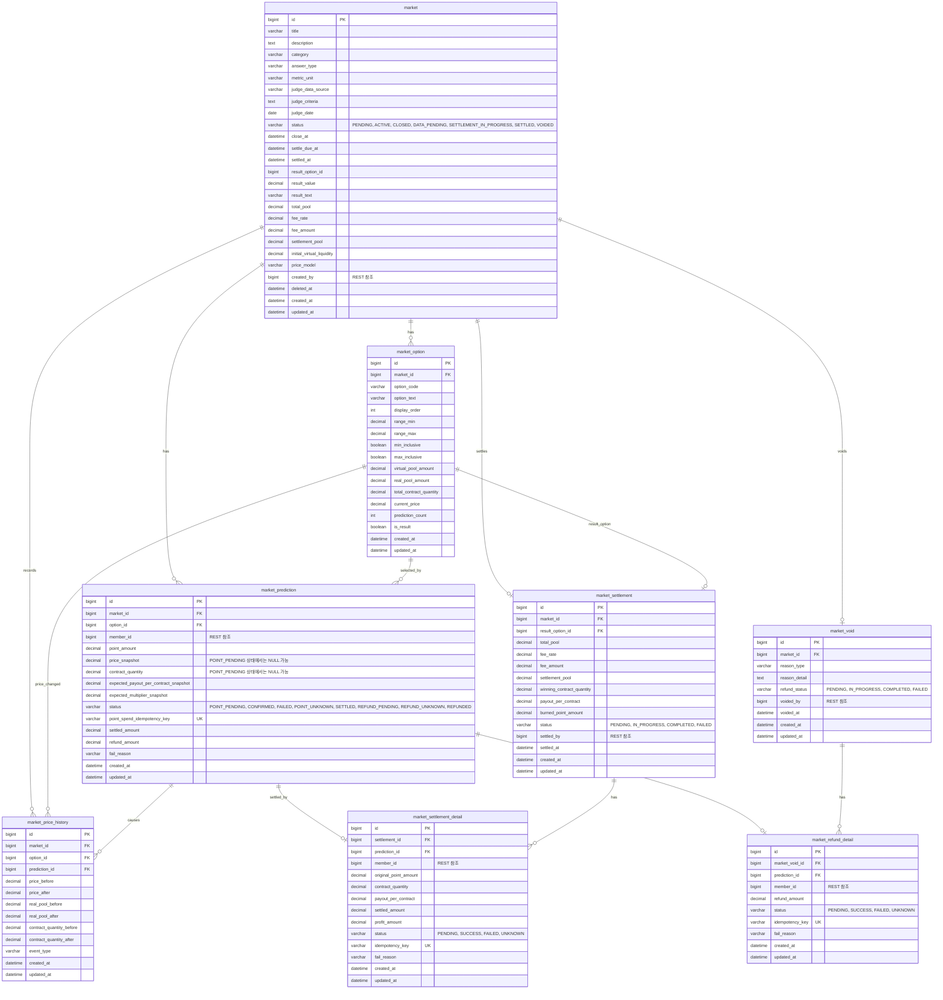

# MARKET_ERD_v2.md

> Market Service 데이터베이스 설계 문서 v2.  
> 본 버전은 API 명세 v2와 동일하게 다음 정책을 반영한다.
>
> - 예측 참여는 `POINT_PENDING` 선저장 후 Member-Point API 호출, 이후 가격 확정 트랜잭션으로 분리한다.
> - 가격 확정 트랜잭션은 Market row와 해당 Market의 모든 MarketOption row를 비관적 락으로 잡는다.
> - Market DB에는 `reference_type`, `reference_id`를 중복 저장하지 않는다.
> - Member-Point 호출 시 애플리케이션 코드에서 `referenceType=MARKET_PREDICTION`, `referenceId=predictionId`를 만들어 보낸다.
> - 정산/환불 멱등성은 batch가 아니라 detail item 단위로 보장한다.

---

# 1. 설계 방향

Market Service는 사용자가 Point를 사용해 객관적으로 판정 가능한 지역 이벤트를 예측하는 도메인이다.

Market은 YES/NO뿐 아니라 다중 선택지와 수치 구간형 선택지를 지원한다.

```text
YES_NO          : 상승 / 하락, YES / NO
MULTIPLE_CHOICE : 여러 개의 일반 선택지
NUMERIC_RANGE   : 수치 구간 기반 선택지
```

Market은 Battle과 달리 사용자의 투표 결과로 승패가 결정되지 않는다.  
결과는 공공데이터, 외부 지표, 관리자 검수 기준에 의해 확정된다.

---

# 2. 서비스 간 참조 원칙

Market Service는 독립 DB를 가진다.

다른 서비스의 테이블을 직접 FK로 참조하지 않는다.  
다른 서비스 데이터가 필요한 경우 REST API를 통해 조회한다.

| 컬럼 | 의미 | 참조 방식 |
|---|---|---|
| `created_by` | Market 생성자 | Member-Point REST 조회 |
| `member_id` | 예측 참여자 | Member-Point REST 조회 |
| `settled_by` | 정산 관리자 | Member-Point REST 조회 |
| `voided_by` | 무효 처리 관리자 | Member-Point REST 조회 |

---

# 3. Member-Point referenceType 연동 기준

Market이 Member-Point API를 호출할 때는 다음 값을 전달한다.

```text
referenceType = MARKET_PREDICTION
referenceId = predictionId
```

이 값은 Member-Point의 `point_history`에 기록된다.

Market DB에는 이미 `prediction_id`가 있으므로 `reference_type`, `reference_id` 컬럼을 별도로 저장하지 않는다.

| Market 상황 | Member-Point type | referenceType | referenceId |
|---|---|---|---|
| 예측 참여 차감 | `SPEND_MARKET` | `MARKET_PREDICTION` | predictionId |
| 정산 보상 지급 | `SETTLE_MARKET` | `MARKET_PREDICTION` | predictionId |
| 무효 환불 | `REFUND_MARKET` | `MARKET_PREDICTION` | predictionId |

---

# 4. 동시성 제어 정책

Pool-Share 가격 계산은 전체 선택지 pool 합에 의존한다.

```text
선택지 가격 = 해당 선택지 pool / 전체 선택지 pool 합
```

따라서 선택한 option row만 락 잡는 방식은 사용하지 않는다.

가격 확정 트랜잭션에서는 다음 순서로 락을 잡는다.

```sql
SELECT *
FROM market
WHERE id = :marketId
FOR UPDATE;
```

```sql
SELECT *
FROM market_option
WHERE market_id = :marketId
ORDER BY id
FOR UPDATE;
```

처리 기준:

```text
1. 한 Market 안의 예측 참여 확정은 순차 처리한다.
2. Market row를 먼저 락 잡는다.
3. 해당 Market의 모든 MarketOption row를 optionId 오름차순으로 락 잡는다.
4. 고정 순서로 락을 잡아 데드락 가능성을 줄인다.
5. DB 락을 잡은 트랜잭션 안에서 외부 HTTP API를 호출하지 않는다.
```

---

# 5. 테이블 목록

| 테이블 | 설명 |
|---|---|
| `market` | Market 주제, 판정 기준, 상태, 전체 풀 정보 |
| `market_option` | 선택지, 수치 구간, 현재 가격, 선택지별 풀 정보 |
| `market_prediction` | 사용자별 예측 참여 기록 |
| `market_price_history` | 선택지 가격 변동 이력 |
| `market_settlement` | Market 단위 정산 결과 |
| `market_settlement_detail` | 사용자별 정산 지급 상세 |
| `market_void` | Market 무효 처리 기록 |
| `market_refund_detail` | 무효 처리 시 사용자별 환불 상세 |

---

# 6. 테이블 상세 DDL

## 6-1. market

```sql
CREATE TABLE market (
    id                          BIGINT          NOT NULL AUTO_INCREMENT,

    title                       VARCHAR(255)    NOT NULL,
    description                 TEXT,

    category                    VARCHAR(50)     NOT NULL,
    -- PRICE_INDEX, TRANSACTION_VOLUME, ACTUAL_PRICE, POLICY_EVENT

    answer_type                 VARCHAR(30)     NOT NULL,
    -- YES_NO, MULTIPLE_CHOICE, NUMERIC_RANGE

    metric_unit                 VARCHAR(30),
    -- PERCENT, COUNT, KRW, INDEX_POINT 등

    judge_data_source           VARCHAR(255)    NOT NULL,
    judge_criteria              TEXT            NOT NULL,
    judge_date                  DATE            NOT NULL,

    status                      VARCHAR(30)     NOT NULL DEFAULT 'PENDING',
    -- PENDING, ACTIVE, CLOSED, DATA_PENDING, SETTLEMENT_IN_PROGRESS, SETTLED, VOIDED

    close_at                    DATETIME        NOT NULL,
    settle_due_at               DATETIME,
    settled_at                  DATETIME,

    result_option_id            BIGINT,
    -- 확정된 승리 선택지. market_option.id 논리 참조
    -- 순환 FK 방지를 위해 DDL에서는 FK를 직접 걸지 않는다.

    result_value                DECIMAL(12,4),
    result_text                 VARCHAR(255),

    total_pool                  DECIMAL(10,2)   NOT NULL DEFAULT 0.00,
    fee_rate                    DECIMAL(5,2)    NOT NULL DEFAULT 5.00,
    fee_amount                  DECIMAL(10,2)   NOT NULL DEFAULT 0.00,
    settlement_pool             DECIMAL(10,2)   NOT NULL DEFAULT 0.00,

    initial_virtual_liquidity   DECIMAL(10,2)   NOT NULL DEFAULT 100.00,
    price_model                 VARCHAR(30)     NOT NULL DEFAULT 'POOL_SHARE',

    created_by                  BIGINT          NOT NULL,
    -- Member-Point Service의 member.id 외부 참조

    deleted_at                  DATETIME,
    created_at                  DATETIME        NOT NULL,
    updated_at                  DATETIME        NOT NULL,

    PRIMARY KEY (id),

    INDEX idx_market_status (status),
    INDEX idx_market_close_at (close_at),
    INDEX idx_market_judge_date (judge_date),
    INDEX idx_market_status_close_at (status, close_at)
);
```

---

## 6-2. market_option

```sql
CREATE TABLE market_option (
    id                          BIGINT          NOT NULL AUTO_INCREMENT,

    market_id                   BIGINT          NOT NULL,

    option_code                 VARCHAR(20)     NOT NULL,
    option_text                 VARCHAR(100)    NOT NULL,
    display_order               INT             NOT NULL DEFAULT 0,

    range_min                   DECIMAL(12,4),
    range_max                   DECIMAL(12,4),
    min_inclusive               BOOLEAN         NOT NULL DEFAULT TRUE,
    max_inclusive               BOOLEAN         NOT NULL DEFAULT FALSE,

    virtual_pool_amount         DECIMAL(10,2)   NOT NULL DEFAULT 100.00,
    real_pool_amount            DECIMAL(10,2)   NOT NULL DEFAULT 0.00,
    total_contract_quantity     DECIMAL(24,8)   NOT NULL DEFAULT 0.00000000,

    current_price               DECIMAL(18,8)   NOT NULL DEFAULT 0.00000000,
    prediction_count            INT             NOT NULL DEFAULT 0,

    is_result                   BOOLEAN         NOT NULL DEFAULT FALSE,

    created_at                  DATETIME        NOT NULL,
    updated_at                  DATETIME        NOT NULL,

    PRIMARY KEY (id),

    UNIQUE KEY uq_market_option_code (market_id, option_code),
    INDEX idx_market_option_market_id (market_id),
    INDEX idx_market_option_market_order (market_id, display_order),

    CONSTRAINT fk_market_option_market
        FOREIGN KEY (market_id)
        REFERENCES market(id)
);
```

---

## 6-3. market_prediction

사용자의 예측 참여 기록을 저장한다.

`POINT_PENDING` 상태로 먼저 생성된 뒤, Member-Point 포인트 차감 성공 후 가격 확정 트랜잭션에서 `price_snapshot`, `contract_quantity`가 확정된다.

```sql
CREATE TABLE market_prediction (
    id                                      BIGINT          NOT NULL AUTO_INCREMENT,

    market_id                               BIGINT          NOT NULL,
    option_id                               BIGINT          NOT NULL,

    member_id                               BIGINT          NOT NULL,
    -- Member-Point Service의 member.id 외부 참조

    point_amount                            DECIMAL(10,2)   NOT NULL,
    -- 사용자가 실제로 사용한 Point. 최소 10P, 최대 500P

    price_snapshot                          DECIMAL(18,8),
    -- 예측 확정 시점의 1계약당 가격
    -- POINT_PENDING / POINT_UNKNOWN 상태에서는 NULL 가능

    contract_quantity                       DECIMAL(24,8),
    -- point_amount / price_snapshot
    -- POINT_PENDING / POINT_UNKNOWN 상태에서는 NULL 가능

    expected_payout_per_contract_snapshot   DECIMAL(18,8),
    expected_multiplier_snapshot            DECIMAL(18,8),

    status                                  VARCHAR(30)     NOT NULL DEFAULT 'POINT_PENDING',
    -- POINT_PENDING, CONFIRMED, FAILED, POINT_UNKNOWN, SETTLED, REFUND_PENDING, REFUND_UNKNOWN, REFUNDED

    point_spend_idempotency_key             VARCHAR(150)    NOT NULL UNIQUE,
    -- Member-Point SPEND_MARKET 차감 요청 멱등성 키
    -- MARKET_PREDICTION_SPEND:market:{marketId}:member:{memberId}

    settled_amount                          DECIMAL(10,2),
    refund_amount                           DECIMAL(10,2),

    fail_reason                             VARCHAR(255),

    created_at                              DATETIME        NOT NULL,
    updated_at                              DATETIME        NOT NULL,

    PRIMARY KEY (id),

    UNIQUE KEY uq_market_prediction_member (market_id, member_id),
    INDEX idx_market_prediction_market_status (market_id, status),
    INDEX idx_market_prediction_member_id (member_id),
    INDEX idx_market_prediction_option_status (option_id, status),
    INDEX idx_market_prediction_point_spend_key (point_spend_idempotency_key),

    CONSTRAINT fk_market_prediction_market
        FOREIGN KEY (market_id)
        REFERENCES market(id),

    CONSTRAINT fk_market_prediction_option
        FOREIGN KEY (option_id)
        REFERENCES market_option(id),

    CONSTRAINT chk_market_prediction_point_amount
        CHECK (point_amount >= 10 AND point_amount <= 500)
);
```

> `price_snapshot`, `contract_quantity`는 `POINT_PENDING` 선저장 구조 때문에 NULL을 허용한다.  
> `CONFIRMED`, `SETTLED`, `REFUNDED` 등 확정 이후 상태에서는 애플리케이션 로직에서 NOT NULL을 보장한다.

---

## 6-4. market_price_history

```sql
CREATE TABLE market_price_history (
    id                              BIGINT          NOT NULL AUTO_INCREMENT,

    market_id                       BIGINT          NOT NULL,
    option_id                       BIGINT          NOT NULL,

    prediction_id                   BIGINT,
    -- 어떤 예측 참여로 인해 가격이 변경되었는지 추적

    price_before                    DECIMAL(18,8)   NOT NULL,
    price_after                     DECIMAL(18,8)   NOT NULL,

    real_pool_before                DECIMAL(10,2)   NOT NULL,
    real_pool_after                 DECIMAL(10,2)   NOT NULL,

    contract_quantity_before        DECIMAL(24,8)   NOT NULL,
    contract_quantity_after         DECIMAL(24,8)   NOT NULL,

    event_type                      VARCHAR(30)     NOT NULL DEFAULT 'PREDICTION_CONFIRMED',
    -- MARKET_OPENED, PREDICTION_CONFIRMED, MARKET_SETTLED, MARKET_VOIDED

    created_at                      DATETIME        NOT NULL,
    updated_at                      DATETIME        NOT NULL,

    PRIMARY KEY (id),

    INDEX idx_price_history_market_option (market_id, option_id),
    INDEX idx_price_history_prediction (prediction_id),
    INDEX idx_price_history_market_created (market_id, created_at),

    CONSTRAINT fk_price_history_market
        FOREIGN KEY (market_id)
        REFERENCES market(id),

    CONSTRAINT fk_price_history_option
        FOREIGN KEY (option_id)
        REFERENCES market_option(id),

    CONSTRAINT fk_price_history_prediction
        FOREIGN KEY (prediction_id)
        REFERENCES market_prediction(id)
);
```

---

## 6-5. market_settlement

Market 단위의 정산 결과를 저장한다.

정산 멱등성은 batch 단위가 아니라 `market_settlement_detail.idempotency_key`로 보장한다.

```sql
CREATE TABLE market_settlement (
    id                              BIGINT          NOT NULL AUTO_INCREMENT,

    market_id                       BIGINT          NOT NULL,
    result_option_id                BIGINT          NOT NULL,

    total_pool                      DECIMAL(10,2)   NOT NULL,
    fee_rate                        DECIMAL(5,2)    NOT NULL,
    fee_amount                      DECIMAL(10,2)   NOT NULL,
    settlement_pool                 DECIMAL(10,2)   NOT NULL,

    winning_contract_quantity       DECIMAL(24,8)   NOT NULL,
    payout_per_contract             DECIMAL(18,8)   NOT NULL,

    burned_point_amount             DECIMAL(10,2)   NOT NULL DEFAULT 0.00,

    status                          VARCHAR(30)     NOT NULL DEFAULT 'PENDING',
    -- PENDING, IN_PROGRESS, COMPLETED, FAILED

    settled_by                      BIGINT,
    -- 관리자 member.id 외부 참조

    settled_at                      DATETIME,

    created_at                      DATETIME        NOT NULL,
    updated_at                      DATETIME        NOT NULL,

    PRIMARY KEY (id),

    UNIQUE KEY uq_market_settlement_market (market_id),

    CONSTRAINT fk_market_settlement_market
        FOREIGN KEY (market_id)
        REFERENCES market(id),

    CONSTRAINT fk_market_settlement_result_option
        FOREIGN KEY (result_option_id)
        REFERENCES market_option(id)
);
```

---

## 6-6. market_settlement_detail

사용자별 정산 지급 상세를 저장한다.

승리 선택지에 참여한 사용자별로 하나씩 생성된다.  
정산 지급 멱등성은 이 테이블의 `idempotency_key`가 담당한다.

```sql
CREATE TABLE market_settlement_detail (
    id                              BIGINT          NOT NULL AUTO_INCREMENT,

    settlement_id                   BIGINT          NOT NULL,
    prediction_id                   BIGINT          NOT NULL,

    member_id                       BIGINT          NOT NULL,
    -- Member-Point Service의 member.id 외부 참조

    original_point_amount           DECIMAL(10,2)   NOT NULL,
    contract_quantity               DECIMAL(24,8)   NOT NULL,

    payout_per_contract             DECIMAL(18,8)   NOT NULL,
    settled_amount                  DECIMAL(10,2)   NOT NULL,
    profit_amount                   DECIMAL(10,2)   NOT NULL,

    status                          VARCHAR(30)     NOT NULL DEFAULT 'PENDING',
    -- PENDING, SUCCESS, FAILED, UNKNOWN

    idempotency_key                 VARCHAR(150)    NOT NULL UNIQUE,
    -- 사용자별 정산 지급 멱등성 키
    -- MARKET_SETTLEMENT_REWARD:market:{marketId}:prediction:{predictionId}:member:{memberId}

    fail_reason                     VARCHAR(255),

    created_at                      DATETIME        NOT NULL,
    updated_at                      DATETIME        NOT NULL,

    PRIMARY KEY (id),

    UNIQUE KEY uq_settlement_detail_prediction (prediction_id),
    INDEX idx_settlement_detail_member_id (member_id),
    INDEX idx_settlement_detail_settlement_id (settlement_id),
    INDEX idx_settlement_detail_status (status),
    INDEX idx_settlement_detail_idempotency_key (idempotency_key),

    CONSTRAINT fk_settlement_detail_settlement
        FOREIGN KEY (settlement_id)
        REFERENCES market_settlement(id),

    CONSTRAINT fk_settlement_detail_prediction
        FOREIGN KEY (prediction_id)
        REFERENCES market_prediction(id)
);
```

> Market DB에는 `reference_type`, `reference_id`를 저장하지 않는다.  
> Member-Point 정산 요청 JSON을 만들 때 애플리케이션 코드에서 `referenceType=MARKET_PREDICTION`, `referenceId=predictionId`를 세팅한다.

---

## 6-7. market_void

Market 무효 처리 기록을 저장한다.

환불 멱등성은 batch 단위가 아니라 `market_refund_detail.idempotency_key`로 보장한다.

```sql
CREATE TABLE market_void (
    id                              BIGINT          NOT NULL AUTO_INCREMENT,

    market_id                       BIGINT          NOT NULL,

    reason_type                     VARCHAR(50)     NOT NULL,
    -- DATA_UNAVAILABLE, ADMIN_ERROR, MARKET_CANCELLED, NO_TRANSACTION, ETC

    reason_detail                   TEXT,

    refund_status                   VARCHAR(30)     NOT NULL DEFAULT 'PENDING',
    -- PENDING, IN_PROGRESS, COMPLETED, FAILED

    voided_by                       BIGINT,
    -- 관리자 member.id 외부 참조

    voided_at                       DATETIME        NOT NULL,

    created_at                      DATETIME        NOT NULL,
    updated_at                      DATETIME        NOT NULL,

    PRIMARY KEY (id),

    UNIQUE KEY uq_market_void_market (market_id),

    CONSTRAINT fk_market_void_market
        FOREIGN KEY (market_id)
        REFERENCES market(id)
);
```

---

## 6-8. market_refund_detail

Market 무효 처리 시 사용자별 환불 상세를 저장한다.

환불 API 호출의 멱등성과 실패 재시도 추적을 위해 별도 테이블로 분리한다.

```sql
CREATE TABLE market_refund_detail (
    id                              BIGINT          NOT NULL AUTO_INCREMENT,

    market_void_id                  BIGINT          NOT NULL,
    prediction_id                   BIGINT          NOT NULL,

    member_id                       BIGINT          NOT NULL,
    -- Member-Point Service의 member.id 외부 참조

    refund_amount                   DECIMAL(10,2)   NOT NULL,
    -- 원칙적으로 prediction.point_amount 전액 환불

    status                          VARCHAR(30)     NOT NULL DEFAULT 'PENDING',
    -- PENDING, SUCCESS, FAILED, UNKNOWN

    idempotency_key                 VARCHAR(150)    NOT NULL UNIQUE,
    -- 사용자별 환불 지급 멱등성 키
    -- MARKET_REFUND:market:{marketId}:prediction:{predictionId}:member:{memberId}

    fail_reason                     VARCHAR(255),

    created_at                      DATETIME        NOT NULL,
    updated_at                      DATETIME        NOT NULL,

    PRIMARY KEY (id),

    UNIQUE KEY uq_refund_detail_prediction (prediction_id),
    INDEX idx_refund_detail_member_id (member_id),
    INDEX idx_refund_detail_void_id (market_void_id),
    INDEX idx_refund_detail_status (status),
    INDEX idx_refund_detail_idempotency_key (idempotency_key),

    CONSTRAINT fk_refund_detail_void
        FOREIGN KEY (market_void_id)
        REFERENCES market_void(id),

    CONSTRAINT fk_refund_detail_prediction
        FOREIGN KEY (prediction_id)
        REFERENCES market_prediction(id)
);
```

> Market DB에는 `reference_type`, `reference_id`를 저장하지 않는다.  
> Member-Point 환불 요청 JSON을 만들 때 애플리케이션 코드에서 `referenceType=MARKET_PREDICTION`, `referenceId=predictionId`를 세팅한다.

---

# 7. Mermaid ERD



---

# 8. 주요 인덱스 요약

```sql
CREATE INDEX idx_market_status ON market(status);
CREATE INDEX idx_market_close_at ON market(close_at);
CREATE INDEX idx_market_status_close_at ON market(status, close_at);

CREATE INDEX idx_market_option_market_id ON market_option(market_id);

CREATE INDEX idx_market_prediction_market_status
ON market_prediction(market_id, status);

CREATE INDEX idx_market_prediction_member_id
ON market_prediction(member_id);

CREATE INDEX idx_market_prediction_option_status
ON market_prediction(option_id, status);

CREATE INDEX idx_market_prediction_point_spend_key
ON market_prediction(point_spend_idempotency_key);

CREATE INDEX idx_price_history_market_option
ON market_price_history(market_id, option_id);

CREATE INDEX idx_price_history_market_created
ON market_price_history(market_id, created_at);

CREATE INDEX idx_settlement_detail_status
ON market_settlement_detail(status);

CREATE INDEX idx_settlement_detail_idempotency_key
ON market_settlement_detail(idempotency_key);

CREATE INDEX idx_refund_detail_status
ON market_refund_detail(status);

CREATE INDEX idx_refund_detail_idempotency_key
ON market_refund_detail(idempotency_key);
```

---

# 9. 구현 체크리스트

- [ ] `market_prediction.price_snapshot`은 NULL 허용한다.
- [ ] `market_prediction.contract_quantity`는 NULL 허용한다.
- [ ] `POINT_PENDING` 생성 트랜잭션과 가격 확정 트랜잭션을 분리한다.
- [ ] DB 락을 잡은 상태로 Member-Point HTTP API를 호출하지 않는다.
- [ ] 가격 확정 트랜잭션에서 Market row를 먼저 비관적 락 조회한다.
- [ ] 가격 확정 트랜잭션에서 해당 Market의 모든 option row를 `ORDER BY id FOR UPDATE`로 락 조회한다.
- [ ] Market DB에는 `reference_type`, `reference_id`를 저장하지 않는다.
- [ ] Member-Point API 요청 생성 시 `referenceType=MARKET_PREDICTION`, `referenceId=predictionId`를 세팅한다.
- [ ] 정산 멱등성은 `market_settlement_detail.idempotency_key`로 보장한다.
- [ ] 환불 멱등성은 `market_refund_detail.idempotency_key`로 보장한다.
- [ ] `market_settlement`에는 batch 단위 `idempotency_key`를 두지 않는다.
- [ ] `market_void`에는 batch 단위 `idempotency_key`를 두지 않는다.
