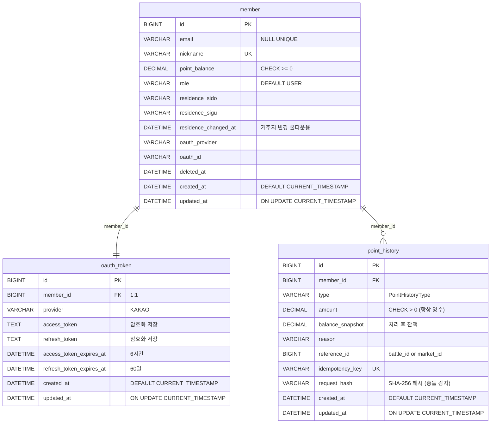

# Member-Point Service ERD

> Member-Point Service의 데이터베이스 설계이다.
> 전체 서비스 ERD 개요는 `docs/ERD.md`를 참조한다.

---

## 1. 테이블 목록

| 테이블 | 설명 |
|---|---|
| `member` | 회원 정보, 포인트 잔액 |
| `oauth_token` | 카카오 OAuth 토큰 (access/refresh) |
| `point_history` | 포인트 적립/차감/정산 이력 |

---

## 2. 테이블 DDL

### 2-1. member

```sql
CREATE TABLE member (
    id                   BIGINT          NOT NULL AUTO_INCREMENT,
    email                VARCHAR(255)    NULL UNIQUE,
    nickname             VARCHAR(50)     NOT NULL UNIQUE,
    point_balance        DECIMAL(10,2)   NOT NULL DEFAULT 0.00 CHECK (point_balance >= 0),
    role                 VARCHAR(20)     NOT NULL DEFAULT 'USER',
    residence_sido       VARCHAR(50),
    residence_sigu       VARCHAR(50),
    residence_changed_at DATETIME,
    oauth_provider       VARCHAR(20)     NOT NULL,
    oauth_id             VARCHAR(255)    NOT NULL,
    deleted_at           DATETIME,
    created_at           DATETIME        NOT NULL DEFAULT CURRENT_TIMESTAMP,
    updated_at           DATETIME        NOT NULL DEFAULT CURRENT_TIMESTAMP ON UPDATE CURRENT_TIMESTAMP,
    PRIMARY KEY (id),
    UNIQUE KEY uq_oauth (oauth_provider, oauth_id)
);
```

### 2-2. oauth_token

```sql
CREATE TABLE oauth_token (
    id                       BIGINT      NOT NULL AUTO_INCREMENT,
    member_id                BIGINT      NOT NULL UNIQUE,
    provider                 VARCHAR(20) NOT NULL,
    access_token             TEXT        NOT NULL,
    refresh_token            TEXT        NOT NULL,
    access_token_expires_at  DATETIME    NOT NULL,
    refresh_token_expires_at DATETIME    NOT NULL,
    created_at               DATETIME    NOT NULL DEFAULT CURRENT_TIMESTAMP,
    updated_at               DATETIME    NOT NULL DEFAULT CURRENT_TIMESTAMP ON UPDATE CURRENT_TIMESTAMP,
    PRIMARY KEY (id),
    FOREIGN KEY (member_id) REFERENCES member(id)
);
```

### 2-3. point_history

```sql
CREATE TABLE point_history (
    id                  BIGINT          NOT NULL AUTO_INCREMENT,
    member_id           BIGINT          NOT NULL,
    type                VARCHAR(50)     NOT NULL,                    -- PointHistoryType (방향 구분)
    amount              DECIMAL(10,2)   NOT NULL CHECK (amount > 0), -- 항상 양수
    balance_snapshot    DECIMAL(10,2)   NOT NULL,                    -- 처리 후 잔액
    reason              VARCHAR(255),
    reference_id        BIGINT,                                      -- 연관 battle_id / market_id
    idempotency_key     VARCHAR(100)    UNIQUE,                      -- 중복 처리 방지
    request_hash        VARCHAR(64)     NULL,                        -- SHA-256(memberId+type+amount+referenceId) 충돌 감지용, idempotency_key 없는 경우 NULL
    created_at          DATETIME        NOT NULL DEFAULT CURRENT_TIMESTAMP,
    updated_at          DATETIME        NOT NULL DEFAULT CURRENT_TIMESTAMP ON UPDATE CURRENT_TIMESTAMP,
    PRIMARY KEY (id),
    FOREIGN KEY (member_id) REFERENCES member(id)
);

-- 인덱스
CREATE INDEX idx_point_history_member_id ON point_history(member_id);
CREATE INDEX idx_point_history_created_at ON point_history(created_at);
CREATE INDEX idx_point_history_type ON point_history(type);
CREATE INDEX idx_point_history_idempotency_key ON point_history(idempotency_key);
```

---

## 3. ERD 다이어그램



---

## 4. Enum 정의

### 4-1. MemberRole

```java
public enum MemberRole {
    USER,   // 일반 사용자
    ADMIN   // 관리자
}
```

### 4-2. PointHistoryType

```java
public enum PointHistoryType {
    // 적립 (EARN)
    EARN_SIGNUP,            // 신규 가입 보상
    EARN_VOTE,              // Battle 투표 참여 보상
    EARN_VOTE_WIN,          // Battle 승리 진영 추가 보상
    EARN_COMMENT,           // Battle 댓글 작성 보상
    EARN_BATTLE_APPROVED,   // Battle 주제 등록 승인 보상

    // 차감 (SPEND)
    SPEND_MARKET,           // Market 예측 참여
    SPEND_INSIGHT,          // Insight 열람
    SPEND_BATTLE_CREATE,    // Battle 주제 생성권
    SPEND_SLOT,             // 관심 지역 슬롯 확장

    // 정산 (SETTLE)
    SETTLE_MARKET,          // Market 정산 보상
    REFUND_MARKET,          // Market 무효 환불
    REFUND_INSIGHT,         // AI 리포트 생성 실패 환불

    // 시스템
    BURN                    // 소각 (소수점 처리)
}
```

---

## 5. 비즈니스 제약

| 항목 | 내용 |
|---|---|
| point_balance | 음수 불가 (CHECK 제약) |
| amount | 항상 양수 (CHECK 제약), 방향은 type으로 구분 |
| idempotency_key | UNIQUE 제약, 중복 처리 방지 |
| request_hash | SHA-256(memberId + type + amount + referenceId), 같은 키로 다른 요청 감지 |
| 거주지 변경 | 30일마다 1회 (residence_changed_at으로 추적) |
| soft delete | deleted_at 설정, 물리 삭제 금지 |
| 토큰 저장 | access_token, refresh_token 암호화 필수 |

---

## 6. request_hash 생성 규칙

```java
// 예시 코드
String raw = memberId + "|" + type + "|" + amount + "|" + referenceId;
String hash = sha256(raw);
// 결과: "a3f8c2d1e9b4..."  (64자리 16진수)
```

같은 키로 다른 요청이 들어왔을 때 감지 방법:
```
저장된 request_hash: "a3f8c2d1..."  (amount=100 기준)
새 요청 request_hash: "b7e9a4f2..."  (amount=999 기준)
  ↓ 다르면 IDEMPOTENCY_KEY_CONFLICT
```

---

## 7. 변경 이력

| 버전 | 변경 내용 |
|---|---|
| v1 | `oauth_token` 테이블 추가 |
| v1 | `member` 테이블에 `oauth_provider`, `oauth_id`, `residence_changed_at` 추가 |
| v1 | `point_history` 인덱스 추가 |
| v2 | `point_history.amount` CHECK 제약 추가 |
| v2 | 전체 테이블 `created_at`, `updated_at` 기본값 추가 |
| v2 | `point_history` FK 추가 |
| v3 | `point_history.request_hash` 추가 (SHA-256 기반 충돌 감지) |
| v3 | `point_history.idempotency_key` 인덱스 추가 |
| v4 | `PointHistoryType`에 `REFUND_INSIGHT` 추가 (AI 리포트 생성 실패 환불) |
